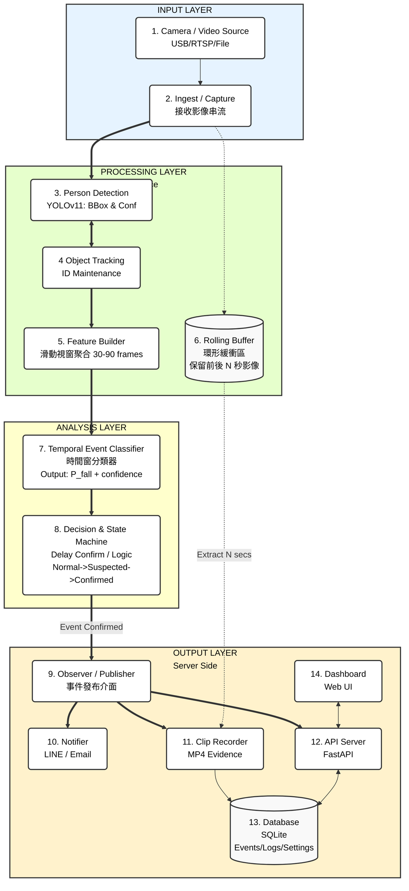

```mermaid
graph TD
    %% 定義樣式
    classDef inputLayer fill:#e6f3ff,stroke:#333,stroke-width:2px,color:black;
    classDef processLayer fill:#e6ffcc,stroke:#333,stroke-width:2px,color:black;
    classDef analysisLayer fill:#ffffcc,stroke:#333,stroke-width:2px,color:black;
    classDef outputLayer fill:#fff2cc,stroke:#333,stroke-width:2px,color:black;
    classDef db fill:#f9f9f9,stroke:#333,stroke-width:2px,shape:cylinder,color:black;
    classDef process fill:#ffffff,stroke:#333,stroke-width:2px,rx:5,ry:5,color:black;

    %% 1. INPUT LAYER
    subgraph Input_Layer ["INPUT LAYER"]
        direction TB
        Cam["1. Camera / Video Source<br/>USB/RTSP/File"]:::process
        Ingest["2. Ingest / Capture<br/>接收影像串流"]:::process
        Cam --> Ingest
    end

    %% 2. PROCESSING LAYER (Edge)
    subgraph Processing_Layer ["PROCESSING LAYER<br/>Edge Inference"]
        direction TB
        
        %% YOLO Module
        YOLO["3. Person Detection<br/>YOLOv11: BBox & Conf"]:::process
        
        %% Tracker Module
        Tracker["4 Object Tracking<br/>ID Maintenance"]:::process

        %% Feature Builder
        FeatBuilder["5. Feature Builder<br/>滑動視窗聚合 30-90 frames"]:::process

        %% Rolling Buffer
        Buffer[("6. Rolling Buffer<br/>環形緩衝區<br/>保留前後 N 秒影像")]:::db

        Ingest ==> YOLO
        YOLO <==> Tracker
        Tracker ==> FeatBuilder
        Ingest -.-> Buffer
    end

    %% 3. ANALYSIS LAYER (Edge Decision)
    subgraph Analysis_Layer ["ANALYSIS LAYER<br/>Decision & Event"]
        direction TB
        
        %% Classifier
        Classifier["7. Temporal Event Classifier<br/>時間窗分類器<br/>Output: P_fall + confidence"]:::process
        
        %% State Machine
        StateMachine["8. Decision & State Machine<br/>Delay Confirm / Logic<br/>Normal->Suspected->Confirmed"]:::process

        FeatBuilder ==> Classifier
        Classifier ==> StateMachine
    end

    %% 4. OUTPUT LAYER (Server / Services)
    subgraph Output_Layer ["OUTPUT LAYER<br/>Server Side"]
        direction TB
        
        Observer["9. Observer / Publisher<br/>事件發布介面"]:::process
        
        %% Subscribers (並行訂閱者)
        Notifier["10. Notifier<br/>LINE / Email"]:::process
        ClipRec["11. Clip Recorder<br/>MP4 Evidence"]:::process
        APIServer["12. API Server<br/>FastAPI"]:::process
        
        %% Storage
        DB[("13. Database<br/>SQLite<br/>Events/Logs/Settings")]:::db
        Dash["14. Dashboard<br/>Web UI"]:::process

        %% Event Flow: Observer broadcasts to all subscribers
        StateMachine == "Event Confirmed" ==> Observer
        
        %% Observer → Subscribers (並行廣播)
        Observer ==> Notifier
        Observer ==> ClipRec
        Observer ==> APIServer
        
        %% ClipRec dependencies
        Buffer -. "Extract N secs" .-> ClipRec
        ClipRec --> DB

        %% API Server serves Dashboard only
        APIServer <--> DB
        Dash <--> APIServer
    end

    %% 跨層連接
    class Input_Layer inputLayer
    class Processing_Layer processLayer
    class Analysis_Layer analysisLayer
    class Output_Layer outputLayer
```