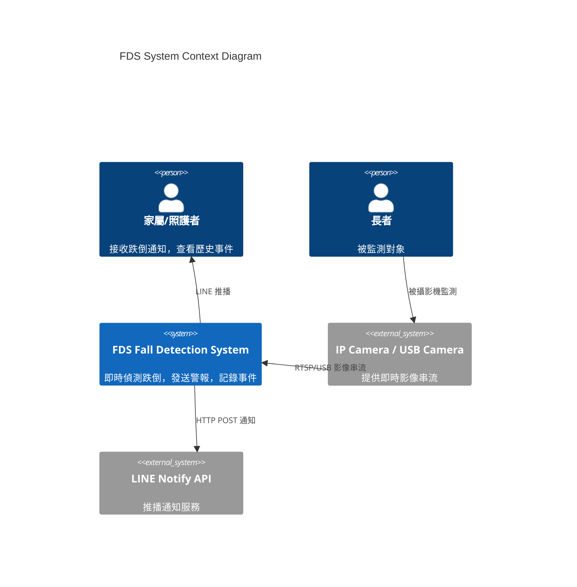
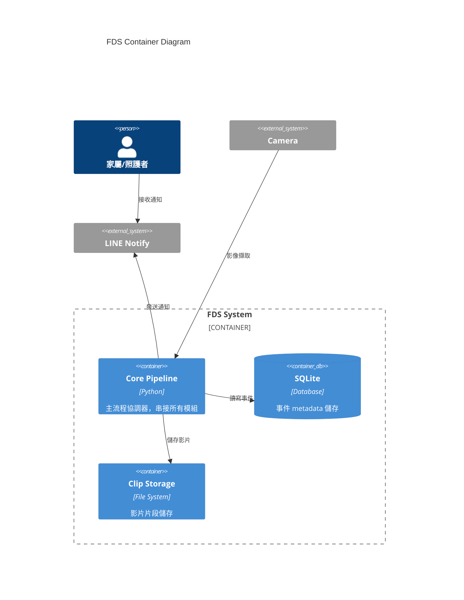
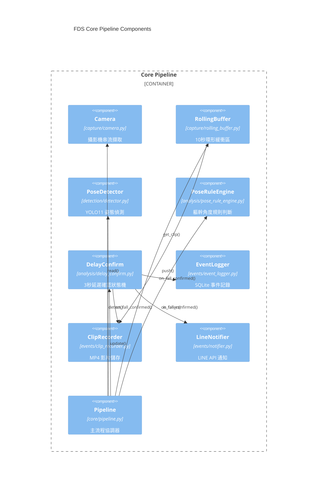
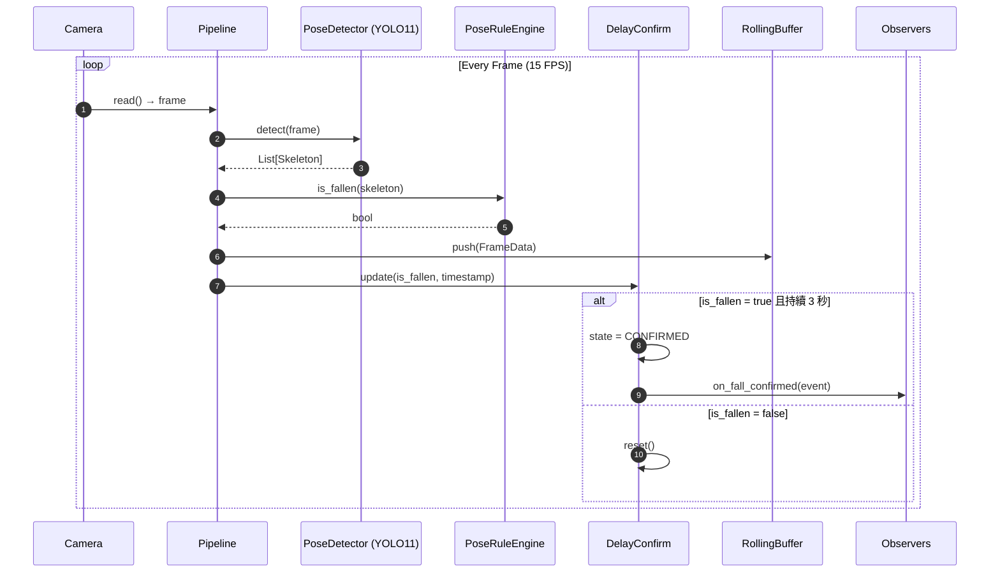
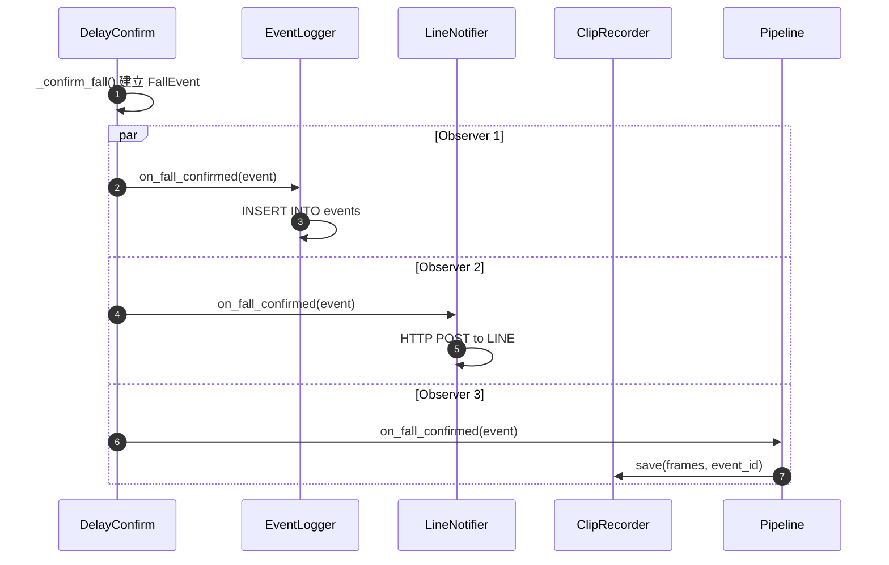
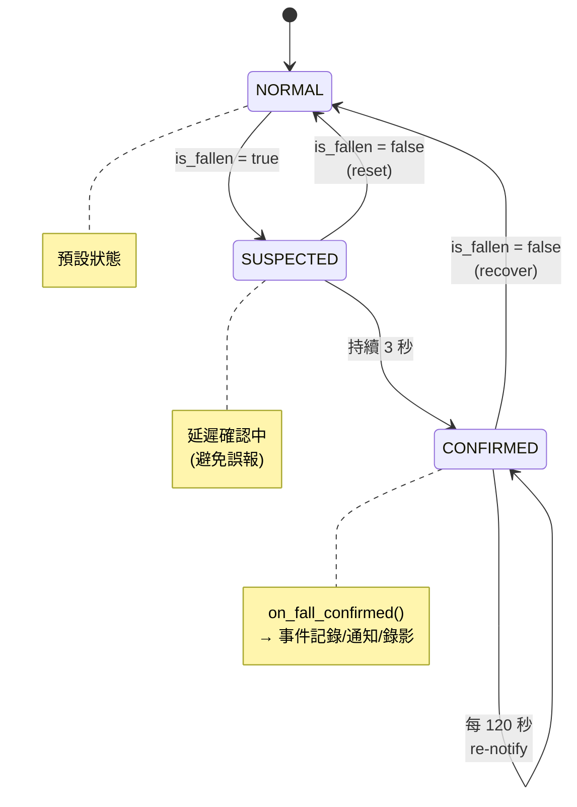
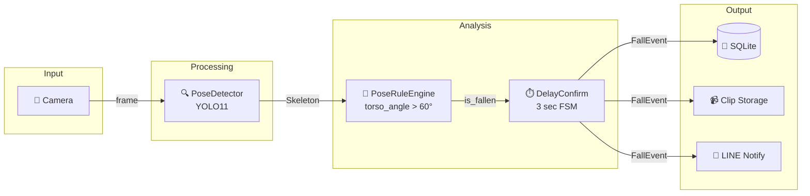
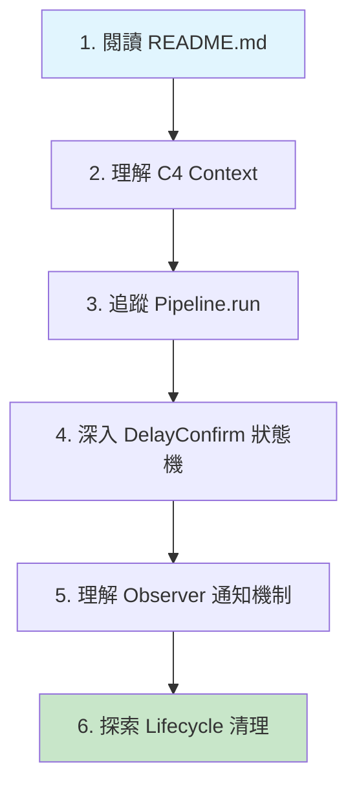

# FDS 系統架構文件

> Fall Detection System 開發者學習指南
>
> 透過 C4 Model、Sequence Diagram 與 SA/SD 分析理解系統設計

---

## 目錄

1. [C4 Model](#c4-model)
   - [Level 1: System Context](#level-1-system-context-diagram)
   - [Level 2: Container](#level-2-container-diagram)
   - [Level 3: Component](#level-3-component-diagram)
2. [Sequence Diagrams](#sequence-diagrams)
   - [主流程：跌倒偵測](#主流程跌倒偵測)
   - [Observer Pattern 事件通知](#observer-pattern-事件通知)
   - [State Machine 狀態轉換](#state-machine-狀態轉換)
3. [SA/SD 分析](#sasd-分析)
   - [Data Flow Diagram](#data-flow-diagram)
   - [模組職責與邊界](#模組職責與邊界)
4. [設計模式](#設計模式)

---

## C4 Model

### Level 1: System Context Diagram

展示 FDS 系統與外部角色/系統的關係。



**解讀重點：**

- FDS 是一個**邊緣運算系統**，部署在本地設備（如樹莓派）
- 對外依賴：攝影機（輸入）、LINE API（通知）
- 使用者透過 **LINE 通知** 與系統互動

---

### Level 2: Container Diagram

展示 FDS 內部主要的可部署單元（Container）。



**Docker 部署對應：**

| Container     | Docker Service | 說明             |
| ------------- | -------------- | ---------------- |
| Core Pipeline | `fds`          | 主服務，CPU-only |
| SQLite        | Volume mount   | `data/fds.db`    |
| Clip Storage  | Volume mount   | `data/clips/`    |

---

### Level 3: Component Diagram

展示 Core Pipeline 內部的元件關係。



**元件分層說明：**

| 層級                 | 模組         | 職責             |
| -------------------- | ------------ | ---------------- |
| **Input Layer**      | `capture/`   | 影像擷取與緩衝   |
| **Processing Layer** | `detection/` | AI 模型推論      |
| **Analysis Layer**   | `analysis/`  | 規則判斷與狀態機 |
| **Output Layer**     | `events/`    | 事件處理與通知   |
| **Lifecycle Layer**  | `lifecycle/` | 影片清理排程     |
| **Orchestration**    | `core/`      | 流程整合         |

---

## Sequence Diagrams

### 主流程：跌倒偵測



**流程解讀：**

1. **Frame Capture**：每秒 15 幀從攝影機讀取
2. **Detection**：YOLO11 偵測人體骨架 (17 keypoints)
3. **Rule Check**：軀幹角度 > 60° 視為跌倒
4. **Delay Confirm**：持續 3 秒才確認，避免誤報
5. **Notify Observers**：觸發事件記錄、通知、錄影

---

### Observer Pattern 事件通知



**設計優勢：**

- 新增 Observer（如 Email 通知）無需修改 `DelayConfirm`
- 各 Observer 獨立運作，不互相影響
- 符合 **開放封閉原則 (OCP)**

---

### State Machine 狀態轉換



**狀態說明：**

| 狀態        | 說明         | 觸發條件          | Observer 通知         |
| ----------- | ------------ | ----------------- | --------------------- |
| `NORMAL`    | 正常站立     | 預設/恢復         | -                     |
| `SUSPECTED` | 疑似跌倒     | 軀幹角度 > 60°    | -                     |
| `CONFIRMED` | 確認跌倒     | 疑似狀態持續 3 秒 | `on_fall_confirmed()` |

**狀態轉換時的 Observer 通知：**

| 轉換                  | 通知方法                       | 接收者                                    |
| --------------------- | ------------------------------ | ----------------------------------------- |
| SUSPECTED → CONFIRMED | `on_fall_confirmed(FallEvent)` | `EventLogger`, `LineNotifier`, `Pipeline` |
| CONFIRMED → NORMAL    | `on_fall_recovered(FallEvent)` | `EventLogger`, `LineNotifier`             |

---

## SA/SD 分析

### Data Flow Diagram



---

### 模組職責與邊界

```
┌──────────────────────────────────────────────────────────────────────────────────┐
│                                     src/                                          │
├─────────────┬─────────────┬─────────────┬─────────────┬─────────────┬────────────┤
│   capture/  │  detection/ │  analysis/  │   events/   │  lifecycle/ │    core/   │
├─────────────┼─────────────┼─────────────┼─────────────┼─────────────┼────────────┤
│ Camera      │ PoseDetect  │ PoseRule    │ Observer    │ ClipCleanup │ Config     │
│ RollingBuf  │ Skeleton    │ DelayConf   │ EventLogger │ Scheduler   │ Pipeline   │
│             │             │ Smoothing   │ Notifier    │             │            │
│             │             │             │ ClipRecord  │             │            │
├─────────────┼─────────────┼─────────────┼─────────────┼─────────────┼────────────┤
│ 影像擷取    │ AI推論      │ 規則/狀態機 │ 事件處理    │ 清理排程    │ 整合       │
│ 資料緩衝    │ 骨架提取    │ 關鍵點平滑  │ 對外通知    │             │ 設定       │
└─────────────┴─────────────┴─────────────┴─────────────┴─────────────┴────────────┘

                               ↓ 依賴方向 ↓

     capture ← detection ← analysis ← events ← lifecycle ← core(Pipeline)
```

**模組依賴原則：**

- 箭頭方向表示「被依賴」
- `Pipeline` 是最外層，依賴所有其他模組
- `capture/` 是最內層，不依賴其他業務模組

---

## 設計模式

### 1. Observer Pattern

**位置**：[observer.py](mdc:src/events/observer.py)

```python
class FallEventObserver(Protocol):
    def on_fall_confirmed(self, event: FallEvent) -> None: ...
    def on_fall_recovered(self, event: FallEvent) -> None: ...
```

**應用**：`DelayConfirm` 通知 `EventLogger`, `LineNotifier`, `Pipeline`

**設計優勢**：

- 新增 Observer（如 Email 通知）無需修改 `DelayConfirm`
- 各 Observer 獨立運作，不互相影響
- 符合開放封閉原則 (OCP)

---

### 2. State Machine Pattern

**位置**：[delay_confirm.py](mdc:src/analysis/delay_confirm.py)

```python
class FallState(Enum):
    NORMAL = "normal"
    SUSPECTED = "suspected"
    CONFIRMED = "confirmed"
```

**應用**：管理跌倒偵測的狀態轉換邏輯，CONFIRMED 狀態時觸發 Observer 通知

---

### 3. Pipeline Pattern

**位置**：[pipeline.py](mdc:src/core/pipeline.py)

```python
def process_frame(self, frame, current_time) -> FallState:
    skeletons = self.detector.detect(frame)    # Step 1
    is_fallen = self.rule_engine.is_fallen()   # Step 2
    self.rolling_buffer.push(frame_data)       # Step 3
    state = self.delay_confirm.update()        # Step 4
    return state
```

**應用**：將多個處理步驟串接成線性流程

---

## 學習路徑建議



| 步驟 | 檔案                                                  | 學習重點           |
| ---- | ----------------------------------------------------- | ------------------ |
| 1    | [README.md](mdc:README.md)                            | 功能概覽、快速開始 |
| 2    | 本文件                                                | 系統邊界、外部依賴 |
| 3    | [pipeline.py](mdc:src/core/pipeline.py)               | 主流程、元件串接   |
| 4    | [delay_confirm.py](mdc:src/analysis/delay_confirm.py) | 狀態機設計         |
| 5    | [observer.py](mdc:src/events/observer.py)             | Observer 模式應用  |
| 6    | [cleanup_scheduler.py](mdc:src/lifecycle/cleanup_scheduler.py) | 資料生命週期 |

---

_文件更新日期：2026-01-04_
