# FDS 系統架構文件

> Fall Detection System 開發者學習指南
>
> 透過 C4 Model、Sequence Diagram 與 SA/SD 分析理解系統設計

---

## 目錄

1. [系統架構總覽](#系統架構總覽)
2. [四層架構設計](#四層架構設計)
3. [C4 Model](#c4-model)
4. [Sequence Diagrams](#sequence-diagrams)
5. [SA/SD 分析](#sasd-分析)
6. [設計模式](#設計模式)
7. [學習路徑建議](#學習路徑建議)

---

## 系統架構總覽

FDS 採用 **四層架構設計**，將系統職責清晰分離：

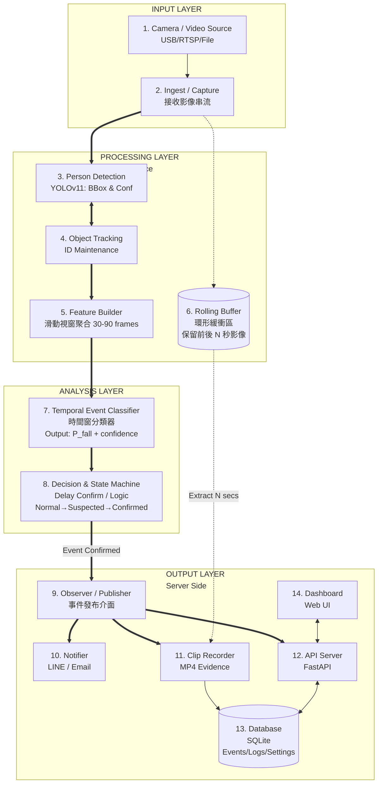

---

## 四層架構設計

### Layer 1: INPUT LAYER

| 元件 | 職責 | 實作 |
|------|------|------|
| **Camera / Video Source** | 提供影像來源 | USB Camera、RTSP、影片檔案 |
| **Ingest / Capture** | 接收並解碼影像串流 | `capture/camera.py` |

### Layer 2: PROCESSING LAYER (Edge Inference)

| 元件 | 職責 | 實作 |
|------|------|------|
| **Person Detection** | YOLO11 偵測人體骨架 | `detection/detector.py` |
| **Object Tracking** | 維護人員 ID 連續性 | `detection/tracker.py` |
| **Feature Builder** | 聚合時間窗特徵 (30-90 frames) | `analysis/feature_builder.py` |
| **Rolling Buffer** | 環形緩衝區，保留事件前後影像 | `capture/rolling_buffer.py` |

### Layer 3: ANALYSIS LAYER (Decision & Event)

| 元件 | 職責 | 實作 |
|------|------|------|
| **Temporal Event Classifier** | 時間序列分類，輸出跌倒機率 | `analysis/classifier.py` |
| **Decision & State Machine** | 狀態機管理 (Normal→Suspected→Confirmed) | `analysis/delay_confirm.py` |

### Layer 4: OUTPUT LAYER (Server Side)

| 元件 | 職責 | 實作 |
|------|------|------|
| **Observer / Publisher** | 事件發布介面，廣播給所有訂閱者 | `events/observer.py` |
| **Notifier** | LINE / Email 通知（直接訂閱 Observer） | `events/notifier.py` |
| **Clip Recorder** | 擷取事件影片存檔（直接訂閱 Observer） | `events/clip_recorder.py` |
| **API Server** | FastAPI HTTP 服務（直接訂閱 Observer） | `web/app.py` |
| **Database** | SQLite 事件儲存 | `data/fds.db` |
| **Dashboard** | Web UI（透過 API Server 存取） | `web/templates/` |

### Observer Pattern 訂閱關係

```
Observer (Publisher)
    ├──► Notifier      ← 發送 LINE/Email 通知
    ├──► ClipRecorder  ← 擷取事件影片
    └──► APIServer     ← 寫入 DB + WebSocket 推播 Dashboard
```

**設計優勢**：
- 三個訂閱者**並行獨立**運作
- API Server **不再負責觸發通知**，只服務 Dashboard
- 即使 API Server 掛掉，通知仍能發送

---

## 雙管線架構（居家監控 App）

> **狀態**：規劃中，待 Phase 3 實作
> **設計文件**：[2026-01-06-home-monitoring-app-draft.md](./plans/2026-01-06-home-monitoring-app-draft.md)

為支援 **24/7 即時影像監控** + **事件偵測通知**，系統將擴展為雙管線架構：

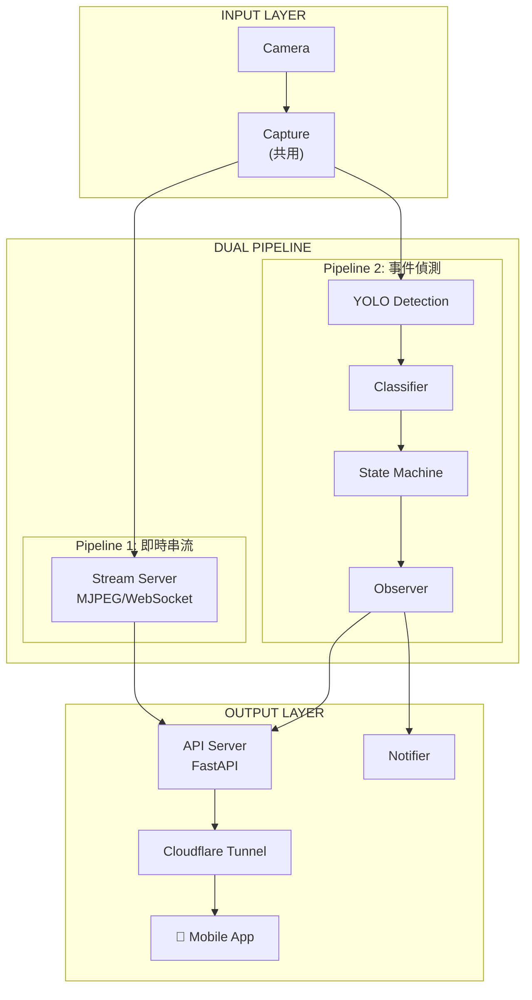

### 設計原則

| 原則 | 說明 |
|------|------|
| **雙管線分離** | 串流與偵測各自獨立 Pipeline |
| **共用 Capture** | 兩條 Pipeline 透過 Queue 訂閱同一 Capture |
| **計算本地化** | AI 推論在 Edge 端執行 |
| **前後端分離** | App 透過 REST API + WebSocket 通訊 |

### Capture 共用機制

為避免 Frame 競爭，採用 **Broadcaster Pattern**：

```
Camera ──► Capture ──► Broadcaster
                           │
              ┌────────────┼────────────┐
              ▼            ▼            ▼
         Queue[1]      Queue[2]     Queue[N]
         (串流)        (偵測)       (未來...)
```

詳細設計參考：[Camera Manager 設計草案](./plans/2026-01-06-camera-manager-draft.md)

### 對外暴露：Cloudflare Tunnel

- **Dashboard 遠端存取**：透過 Cloudflare Tunnel 暴露 FastAPI
- **LINE/Email 通知**：直接 POST（不經過 Tunnel）
- **影片不外傳**：MP4 保留本地，僅傳輸 metadata

詳細設計參考：[Cloudflare Tunnel 整合設計](./plans/2026-01-06-cloudflare-tunnel-integration.md)

---

## C4 Model

### Level 1: System Context Diagram

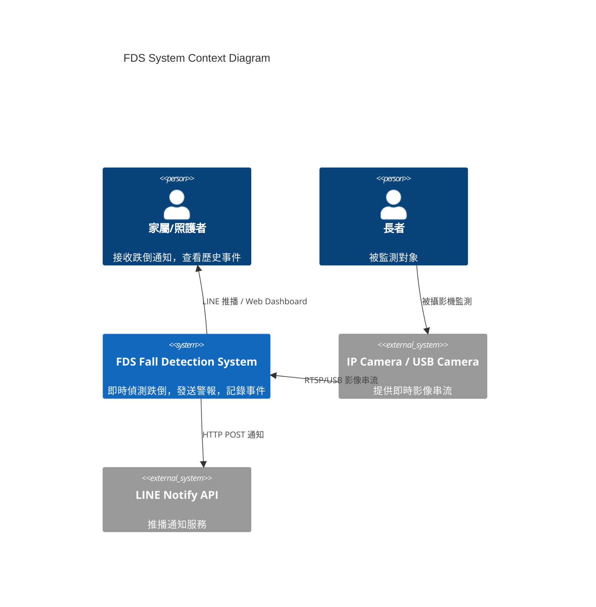

**解讀重點：**

- FDS 是一個 **邊緣運算系統**，部署在本地設備
- 對外依賴：攝影機（輸入）、LINE API（通知）
- 使用者透過 **LINE 通知** 或 **Web Dashboard** 與系統互動

---

### Level 2: Container Diagram

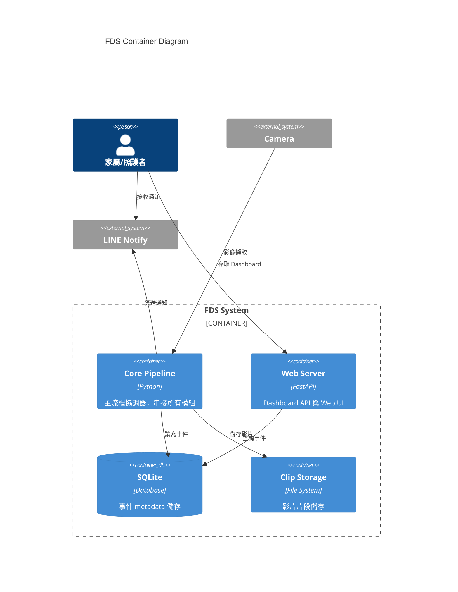

---

### Level 3: Component Diagram

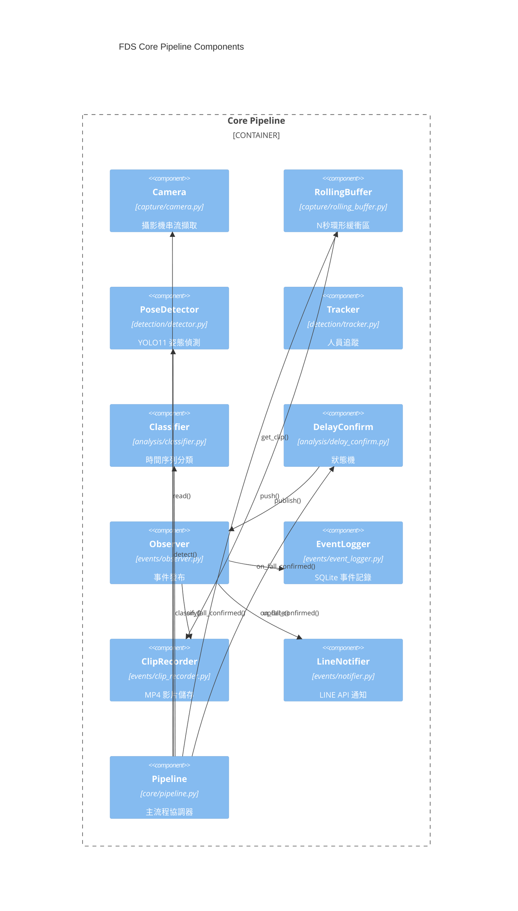

---

## Sequence Diagrams

### 主流程：跌倒偵測

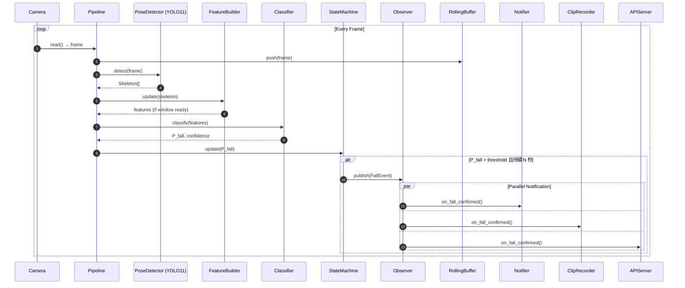

### Observer Pattern 事件通知

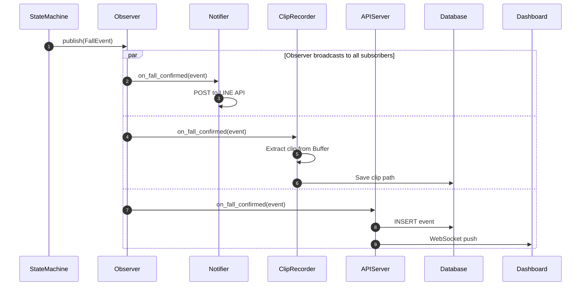

### Post-Event Recording Flow

> 延遲錄製機制：事件確認後等待 `clip_after_sec` 秒，確保擷取事件後的影像

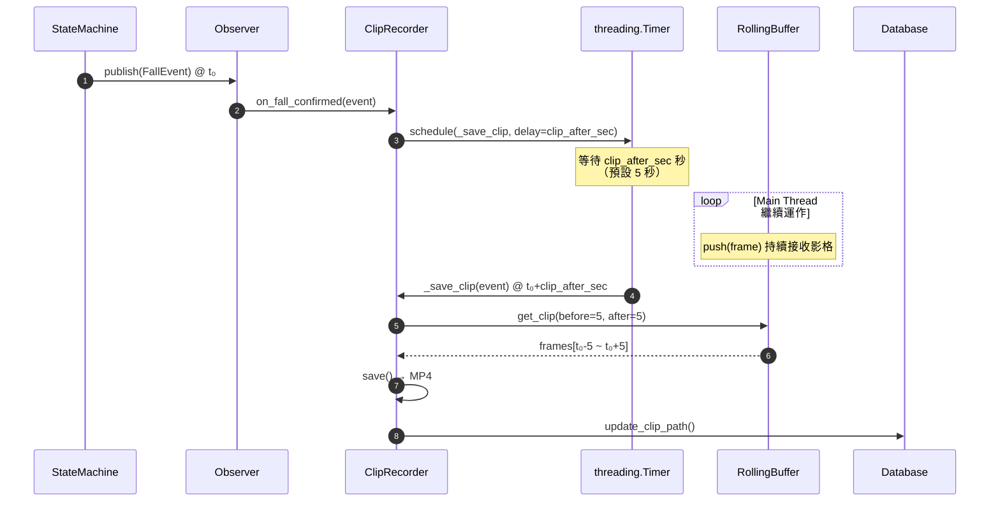

**設計重點：**

| 項目 | 說明 |
|------|------|
| **延遲機制** | `threading.Timer` 延遲 `clip_after_sec` 秒後執行錄製 |
| **Buffer 容量** | `buffer_seconds` >= `delay_sec` + `clip_before_sec` + `clip_after_sec` + margin |
| **Thread Safety** | `RollingBuffer` 使用 `threading.Lock` 保護並發存取 |
| **Graceful Shutdown** | `ClipRecorder.shutdown()` 取消所有 pending timers |

---

### State Machine 狀態轉換

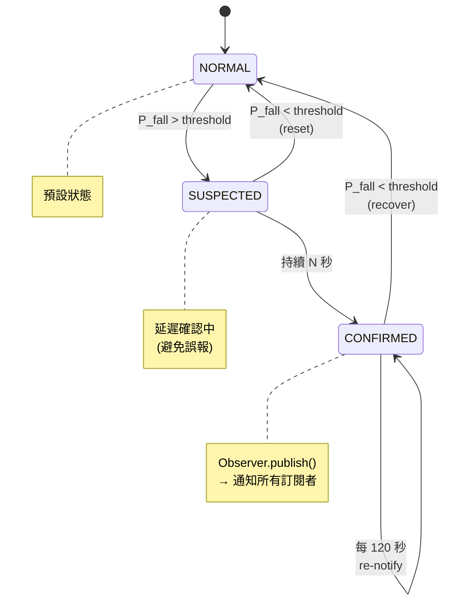

---

## SA/SD 分析

### Data Flow Diagram

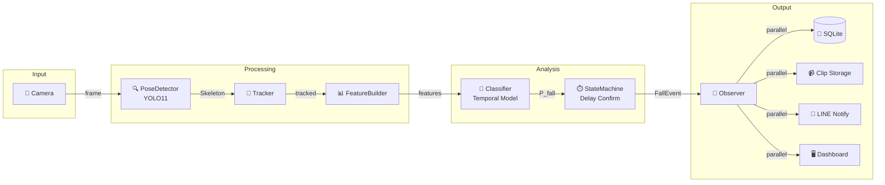

### 模組職責與邊界

```
┌───────────────────────────────────────────────────────────────────────────────────────┐
│                                         src/                                           │
├─────────────┬─────────────┬─────────────┬─────────────┬─────────────┬─────────────────┤
│   capture/  │  detection/ │  analysis/  │   events/   │    web/     │      core/      │
├─────────────┼─────────────┼─────────────┼─────────────┼─────────────┼─────────────────┤
│ Camera      │ Detector    │ Classifier  │ Observer    │ API Server  │ Config          │
│ RollingBuf  │ Tracker     │ StateMachine│ EventLogger │ Dashboard   │ Pipeline        │
│             │             │ FeatureBldr │ Notifier    │ WebSocket   │                 │
│             │             │             │ ClipRecord  │             │                 │
├─────────────┼─────────────┼─────────────┼─────────────┼─────────────┼─────────────────┤
│ INPUT       │ PROCESSING  │ ANALYSIS    │ OUTPUT      │ OUTPUT      │ ORCHESTRATION   │
│ LAYER       │ LAYER       │ LAYER       │ LAYER       │ LAYER       │                 │
└─────────────┴─────────────┴─────────────┴─────────────┴─────────────┴─────────────────┘

                                 ↓ 依賴方向 ↓

       capture ← detection ← analysis ← events ← web ← core(Pipeline)
```

---

## 設計模式

### 1. Observer Pattern

**位置**：`src/events/observer.py`

```python
class FallEventObserver(Protocol):
    def on_fall_confirmed(self, event: FallEvent) -> None: ...
    def on_fall_recovered(self, event: FallEvent) -> None: ...
```

**訂閱者**：
- `Notifier` - LINE/Email 通知
- `ClipRecorder` - 影片擷取
- `APIServer` - DB 寫入 + WebSocket 推播

**設計優勢**：
- 新增訂閱者無需修改 Observer
- 各訂閱者獨立運作，互不影響
- 符合開放封閉原則 (OCP)

---

### 2. State Machine Pattern

**位置**：`src/analysis/delay_confirm.py`

```python
class FallState(Enum):
    NORMAL = "normal"
    SUSPECTED = "suspected"
    CONFIRMED = "confirmed"
```

**狀態轉換**：

| 轉換 | 條件 | 動作 |
|------|------|------|
| NORMAL → SUSPECTED | P_fall > threshold | - |
| SUSPECTED → CONFIRMED | 持續 N 秒 | Observer.publish() |
| CONFIRMED → NORMAL | P_fall < threshold | Observer.on_recovered() |

---

### 3. Pipeline Pattern

**位置**：`src/core/pipeline.py`

```python
def process_frame(self, frame, current_time) -> FallState:
    skeletons = self.detector.detect(frame)       # Step 1
    self.tracker.update(skeletons)                # Step 2
    features = self.feature_builder.update()      # Step 3
    p_fall = self.classifier.classify(features)   # Step 4
    state = self.state_machine.update(p_fall)     # Step 5
    return state
```

---

## 學習路徑建議

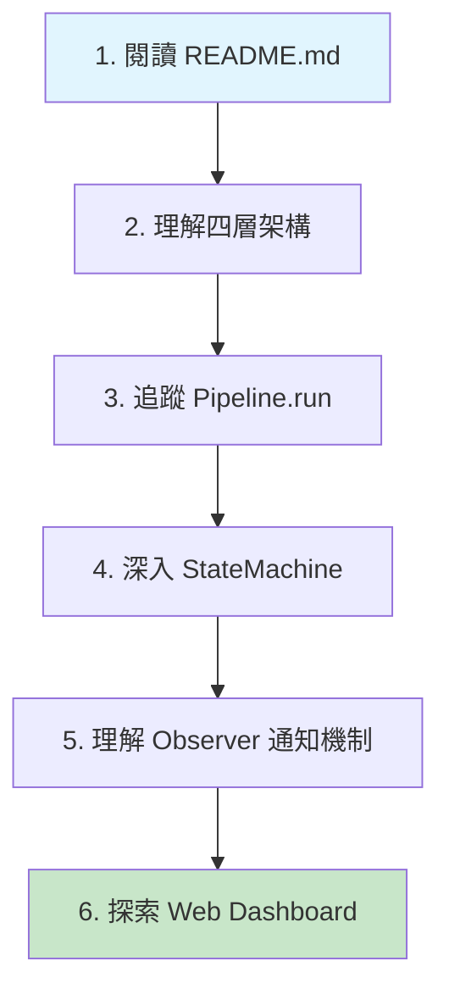

| 步驟 | 檔案 | 學習重點 |
|------|------|----------|
| 1 | `README.md` | 功能概覽、快速開始 |
| 2 | 本文件 | 四層架構、系統邊界 |
| 3 | `src/core/pipeline.py` | 主流程、元件串接 |
| 4 | `src/analysis/delay_confirm.py` | 狀態機設計 |
| 5 | `src/events/observer.py` | Observer 模式應用 |
| 6 | `src/web/` | FastAPI + Dashboard |

---

_文件更新日期：2026-01-06_
