# FDS 系統架構文件

> Fall Detection System 開發者學習指南
>
> 透過 C4 Model、Sequence Diagram 與 SA/SD 分析理解系統設計

---

## 目錄

1. [C4 Model](#c4-model)
   - [Level 1: System Context](#level-1-system-context-diagram)
   - [Level 2: Container](#level-2-container-diagram)
   - [Level 3: Component](#level-3-component-diagram)
2. [Sequence Diagrams](#sequence-diagrams)
   - [主流程：跌倒偵測](#主流程跌倒偵測)
   - [Observer Pattern 事件通知](#observer-pattern-事件通知)
   - [State Machine 狀態轉換](#state-machine-狀態轉換)
3. [SA/SD 分析](#sasd-分析)
   - [Data Flow Diagram](#data-flow-diagram)
   - [模組職責與邊界](#模組職責與邊界)
4. [設計模式](#設計模式)

---

## C4 Model

### Level 1: System Context Diagram

展示 FDS 系統與外部角色/系統的關係。

```mermaid
C4Context
    title FDS System Context Diagram

    Person(user, "家屬/照護者", "接收跌倒通知，查看歷史事件")
    Person(elderly, "長者", "被監測對象")

    System(fds, "FDS Fall Detection System", "即時偵測跌倒，發送警報，記錄事件")

    System_Ext(camera, "IP Camera / USB Camera", "提供即時影像串流")
    System_Ext(line, "LINE Notify API", "推播通知服務")
    System_Ext(gcp, "GCP Cloud Storage", "雲端備份骨架資料")

    Rel(camera, fds, "RTSP/USB 影像串流")
    Rel(fds, line, "HTTP POST 通知")
    Rel(fds, gcp, "上傳 JSON 骨架資料")
    Rel(fds, user, "Web 儀表板 / LINE 推播")
    Rel(elderly, camera, "被攝影機監測")
```



**解讀重點：**

- FDS 是一個**邊緣運算系統**，部署在本地設備（如樹莓派）
- 對外依賴：攝影機（輸入）、LINE API（通知）、GCP（備份）
- 使用者透過 **Web 儀表板** 或 **LINE 通知** 與系統互動

---

### Level 2: Container Diagram

展示 FDS 內部主要的可部署單元（Container）。

```mermaid
C4Container
    title FDS Container Diagram

    Person(user, "家屬/照護者")

    Container_Boundary(fds, "FDS System") {
        Container(core, "Core Pipeline", "Python", "主流程協調器，串接所有模組")
        Container(web, "Web Dashboard", "FastAPI + Jinja2", "本地網頁儀表板")
        ContainerDb(sqlite, "SQLite", "Database", "事件 metadata 儲存")
        Container(clips, "Clip Storage", "File System", "影片片段儲存")
    }

    System_Ext(camera, "Camera")
    System_Ext(line, "LINE Notify")
    System_Ext(gcp, "GCP Storage")

    Rel(camera, core, "影像擷取")
    Rel(core, sqlite, "讀寫事件")
    Rel(core, clips, "儲存影片")
    Rel(core, line, "發送通知")
    Rel(core, gcp, "上傳骨架")
    Rel(web, sqlite, "讀取事件")
    Rel(web, clips, "串流影片")
    Rel(user, web, "HTTP 存取")
```



**Docker 部署對應：**

| Container     | Docker Service | 說明             |
| ------------- | -------------- | ---------------- |
| Core Pipeline | `fds`          | 主服務，CPU-only |
| Web Dashboard | `fds-web`      | FastAPI Web 服務 |
| SQLite        | Volume mount   | `data/fds.db`    |
| Clip Storage  | Volume mount   | `data/clips/`    |

---

### Level 3: Component Diagram

展示 Core Pipeline 內部的元件關係。

```mermaid
C4Component
    title FDS Core Pipeline Components

    Container_Boundary(core, "Core Pipeline") {
        Component(camera, "Camera", "capture/camera.py", "攝影機串流擷取")
        Component(buffer, "RollingBuffer", "capture/rolling_buffer.py", "10秒環形緩衝區")
        Component(detector, "Detector", "detection/detector.py", "YOLOv8 人體偵測")
        Component(skeleton, "SkeletonExtractor", "lifecycle/skeleton_extractor.py", "骨架序列提取")
        Component(rule, "RuleEngine", "analysis/rule_engine.py", "長寬比規則判斷")
        Component(delay, "DelayConfirm", "analysis/delay_confirm.py", "3秒延遲確認狀態機")
        Component(logger, "EventLogger", "events/event_logger.py", "SQLite 事件記錄")
        Component(recorder, "ClipRecorder", "events/clip_recorder.py", "MP4 影片儲存")
        Component(notifier, "LineNotifier", "events/notifier.py", "LINE API 通知")
        Component(pipeline, "Pipeline", "core/pipeline.py", "主流程協調器")
        Component(collector, "SkeletonCollector", "lifecycle/skeleton_collector.py", "非同步骨架收集")
    }

    Rel(pipeline, camera, "read()")
    Rel(pipeline, buffer, "push()")
    Rel(pipeline, detector, "detect()")
    Rel(pipeline, rule, "is_fallen()")
    Rel(pipeline, delay, "update()")
    Rel(delay, logger, "on_fall_confirmed()")
    Rel(delay, notifier, "on_fall_confirmed()")
    Rel(delay, recorder, "on_fall_confirmed()")
    Rel(delay, collector, "on_fall_suspected()")
    Rel(delay, collector, "on_suspicion_cleared()")
    Rel(buffer, recorder, "get_clip()")
    Rel(buffer, collector, "get_clip()")
    Rel(collector, skeleton, "extract_from_frames()")
```



**元件分層說明：**

| 層級                 | 模組         | 職責                         |
| -------------------- | ------------ | ---------------------------- |
| **Input Layer**      | `capture/`   | 影像擷取與緩衝               |
| **Processing Layer** | `detection/` | AI 模型推論                  |
| **Analysis Layer**   | `analysis/`  | 規則判斷與狀態機             |
| **Output Layer**     | `events/`    | 事件處理與通知               |
| **Lifecycle Layer**  | `lifecycle/` | 骨架提取、雲端同步、資料清理 |
| **Orchestration**    | `core/`      | 流程整合                     |

---

## Sequence Diagrams

### 主流程：跌倒偵測


**流程解讀：**

1. **Frame Capture**：每秒 15 幀從攝影機讀取
2. **Detection**：YOLOv8 偵測人體 Bounding Box
3. **Rule Check**：長寬比 < 1.3 視為跌倒
4. **Delay Confirm**：持續 3 秒才確認，避免誤報
5. **Notify Observers**：觸發事件記錄、通知、錄影

---

### Observer Pattern 事件通知

#### FallEventObserver（跌倒確認通知）

```mermaid
sequenceDiagram
    autonumber
    participant DC as DelayConfirm
    participant EL as EventLogger
    participant LN as LineNotifier
    participant CR as ClipRecorder
    participant Pipeline

    DC->>DC: _confirm_fall() 建立 FallEvent

    par Observer 1
        DC->>EL: on_fall_confirmed(event)
        EL->>EL: INSERT INTO events
    and Observer 2
        DC->>LN: on_fall_confirmed(event)
        LN->>LN: HTTP POST to LINE
    and Observer 3
        DC->>Pipeline: on_fall_confirmed(event)
        Pipeline->>CR: save(frames, event_id)
    end
```



#### SuspectedEventObserver（疑似跌倒通知 - 骨架收集）

```mermaid
sequenceDiagram
    autonumber
    participant DC as DelayConfirm
    participant SC as SkeletonCollector
    participant Buf as RollingBuffer
    participant SE as SkeletonExtractor

    Note over DC: NORMAL → SUSPECTED
    DC->>DC: 建立 SuspectedEvent(pending)
    DC->>SC: on_fall_suspected(event)
    SC->>SC: 記錄至 pending_events

    alt 持續 3 秒 → CONFIRMED
        DC->>DC: event.outcome = "confirmed"
        DC->>SC: on_fall_confirmed_update(event)
        SC->>Buf: get_clip(before=5s, after=5s)
        Buf-->>SC: List[FrameData]
        SC->>SE: extract_from_frames(frames)
        SE-->>SC: SkeletonSequence
        SC->>SC: 儲存 sus_xxx_confirmed.json
    else is_fallen=false → NORMAL
        DC->>DC: event.outcome = "cleared"
        DC->>SC: on_suspicion_cleared(event)
        SC->>Buf: get_clip(before=5s, after=5s)
        Buf-->>SC: List[FrameData]
        SC->>SE: extract_from_frames(frames)
        SE-->>SC: SkeletonSequence
        SC->>SC: 儲存 sus_xxx_cleared.json
    end
```



**設計優勢：**

- 新增 Observer（如 Email 通知）無需修改 `DelayConfirm`
- 各 Observer 獨立運作，不互相影響
- 符合 **開放封閉原則 (OCP)**
- **雙層 Observer**：`FallEventObserver` 處理確認事件，`SuspectedEventObserver` 處理疑似階段
- **標註式訓練資料**：輸出檔名自帶標籤（confirmed/cleared），便於機器學習

---

### State Machine 狀態轉換

```mermaid
stateDiagram-v2
    [*] --> NORMAL

    NORMAL --> SUSPECTED : is_fallen = true
    SUSPECTED --> NORMAL : is_fallen = false<br/>(reset)
    SUSPECTED --> CONFIRMED : 持續 3 秒
    CONFIRMED --> NORMAL : is_fallen = false<br/>(recover)
    CONFIRMED --> CONFIRMED : 每 120 秒<br/>re-notify

    note right of NORMAL : 預設狀態
    note right of SUSPECTED : on_fall_suspected()<br/>→ SkeletonCollector 記錄
    note right of CONFIRMED : on_fall_confirmed()<br/>→ 事件記錄/通知/錄影
```



**狀態說明：**

| 狀態        | 說明     | 觸發條件          | Observer 通知         |
| ----------- | -------- | ----------------- | --------------------- |
| `NORMAL`    | 正常站立 | 預設/恢復         | -                     |
| `SUSPECTED` | 疑似跌倒 | 長寬比 < 1.3      | `on_fall_suspected()` |
| `CONFIRMED` | 確認跌倒 | 疑似狀態持續 3 秒 | `on_fall_confirmed()` |

**狀態轉換時的 Observer 通知：**

| 轉換                  | 通知方法                               | 接收者                                    |
| --------------------- | -------------------------------------- | ----------------------------------------- |
| NORMAL → SUSPECTED    | `on_fall_suspected(SuspectedEvent)`    | `SkeletonCollector`                       |
| SUSPECTED → NORMAL    | `on_suspicion_cleared(SuspectedEvent)` | `SkeletonCollector`                       |
| SUSPECTED → CONFIRMED | `on_fall_confirmed(FallEvent)`         | `EventLogger`, `LineNotifier`, `Pipeline` |
| CONFIRMED → NORMAL    | `on_fall_recovered(FallEvent)`         | `EventLogger`, `LineNotifier`, `Pipeline` |

---

## SA/SD 分析

### Data Flow Diagram

```mermaid
flowchart LR
    subgraph Input
        CAM[🎥 Camera]
    end

    subgraph Processing
        DET[🔍 Detector<br/>YOLOv8]
        SKEL[🦴 Skeleton<br/>Extractor]
    end

    subgraph Analysis
        RULE[📐 Rule Engine<br/>ratio < 1.3]
        DELAY[⏱️ Delay Confirm<br/>3 sec FSM]
    end

    subgraph Output
        DB[(💾 SQLite)]
        CLIP[📹 Clip Storage]
        LINE[📱 LINE Notify]
        GCP[☁️ GCP Storage]
    end

    CAM -->|frame| DET
    DET -->|bbox| RULE
    DET -->|keypoints| SKEL
    RULE -->|is_fallen| DELAY
    DELAY -->|FallEvent| DB
    DELAY -->|FallEvent| CLIP
    DELAY -->|FallEvent| LINE
    SKEL -->|skeleton.json| GCP
```



---

### 模組職責與邊界

```
┌──────────────────────────────────────────────────────────────────────────────────┐
│                                     src/                                          │
├─────────────┬─────────────┬─────────────┬─────────────┬─────────────┬────────────┤
│   capture/  │  detection/ │  analysis/  │   events/   │  lifecycle/ │    core/   │
├─────────────┼─────────────┼─────────────┼─────────────┼─────────────┼────────────┤
│ Camera      │ Detector    │ RuleEngine  │ Observer    │ Skeleton    │ Config     │
│ RollingBuf  │ BBox        │ DelayConf   │ EventLogger │ Extractor   │ Pipeline   │
│             │ Skeleton    │             │ Notifier    │ Collector   │            │
│             │             │             │ ClipRecord  │ CloudSync   │            │
│             │             │             │             │ ClipCleanup │            │
├─────────────┼─────────────┼─────────────┼─────────────┼─────────────┼────────────┤
│ 影像擷取    │ AI推論      │ 規則/狀態機 │ 事件處理    │ 資料生命    │ 整合       │
│ 資料緩衝    │ 特徵提取    │             │ 對外通知    │ 週期管理    │ 設定       │
└─────────────┴─────────────┴─────────────┴─────────────┴─────────────┴────────────┘

                               ↓ 依賴方向 ↓

     capture ← detection ← analysis ← events ← lifecycle ← core(Pipeline)
```

**模組依賴原則：**

- 箭頭方向表示「被依賴」
- `Pipeline` 是最外層，依賴所有其他模組
- `capture/` 是最內層，不依賴其他業務模組
- `lifecycle/` 依賴 `capture/`（RollingBuffer）和 `detection/`（PoseDetector）

---

## 設計模式

### 1. Observer Pattern（雙層設計）

**位置**：[observer.py](mdc:src/events/observer.py)

#### FallEventObserver（確認階段）

```python
class FallEventObserver(Protocol):
    def on_fall_confirmed(self, event: FallEvent) -> None: ...
    def on_fall_recovered(self, event: FallEvent) -> None: ...
```

**應用**：`DelayConfirm` 通知 `EventLogger`, `LineNotifier`, `Pipeline`

#### SuspectedEventObserver（疑似階段）

```python
class SuspectedEventObserver(Protocol):
    def on_fall_suspected(self, event: SuspectedEvent) -> None: ...
    def on_suspicion_cleared(self, event: SuspectedEvent) -> None: ...
```

**應用**：`DelayConfirm` 通知 `SkeletonCollector` 進行骨架收集

**設計優勢**：

- 雙層 Observer 分離「疑似」與「確認」階段處理
- `SkeletonCollector` 可在 SUSPECTED 階段提前記錄事件，待結果確定後提取骨架
- 輸出檔名自帶標籤（`_confirmed.json` / `_cleared.json`），便於機器學習訓練

---

### 2. State Machine Pattern

**位置**：[delay_confirm.py](mdc:src/analysis/delay_confirm.py)

```python
class FallState(Enum):
    NORMAL = "normal"
    SUSPECTED = "suspected"
    CONFIRMED = "confirmed"
```

**應用**：管理跌倒偵測的狀態轉換邏輯，並在狀態轉換時觸發對應的 Observer 通知

---

### 3. Pipeline Pattern

**位置**：[pipeline.py](mdc:src/core/pipeline.py)

```python
def process_frame(self, frame, current_time) -> FallState:
    bboxes = self.detector.detect(frame)      # Step 1
    is_fallen = self.rule_engine.is_fallen()  # Step 2
    self.rolling_buffer.push(frame_data)      # Step 3
    state = self.delay_confirm.update()       # Step 4
    return state
```

**應用**：將多個處理步驟串接成線性流程

---

## 學習路徑建議

```mermaid
graph TD
    A[1. 閱讀 README.md] --> B[2. 理解 C4 Context]
    B --> C[3. 追蹤 Pipeline.run]
    C --> D[4. 深入 DelayConfirm 狀態機]
    D --> E[5. 理解 Observer 通知機制]
    E --> F[6. 探索 SkeletonCollector]
    F --> G[7. 探索 Web 儀表板]

    style A fill:#e1f5fe
    style G fill:#c8e6c9
```



| 步驟 | 檔案                                                             | 學習重點                  |
| ---- | ---------------------------------------------------------------- | ------------------------- |
| 1    | [README.md](mdc:README.md)                                       | 功能概覽、快速開始        |
| 2    | 本文件                                                           | 系統邊界、外部依賴        |
| 3    | [pipeline.py](mdc:src/core/pipeline.py)                          | 主流程、元件串接          |
| 4    | [delay_confirm.py](mdc:src/analysis/delay_confirm.py)            | 狀態機設計、雙層 Observer |
| 5    | [observer.py](mdc:src/events/observer.py)                        | 設計模式應用              |
| 6    | [skeleton_collector.py](mdc:src/lifecycle/skeleton_collector.py) | 骨架收集機制              |
| 7    | [pages.py](mdc:src/web/routes/pages.py)                          | Web 整合                  |

---

_文件更新日期：2025-12-31_
