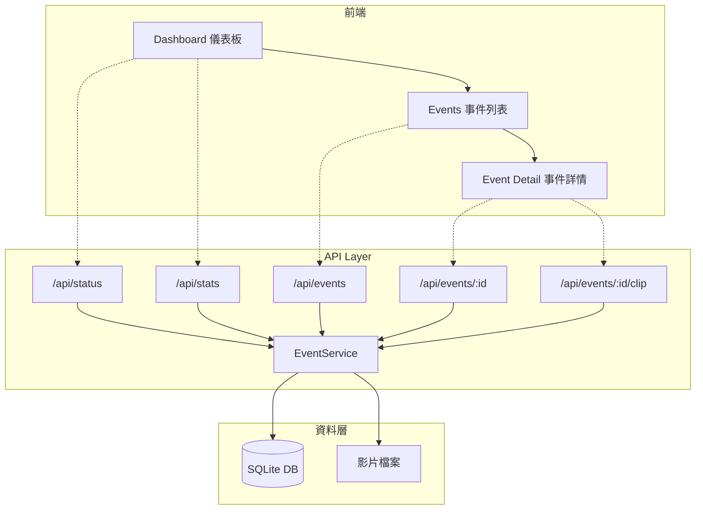

# FDS Web Dashboard API 規格書

> Fall Detection System (FDS) 網頁儀表板 API 文檔

## 📋 概覽

本文件描述 FDS Web Dashboard 提供的所有 RESTful API 端點和網頁路由，供前端開發和系統驗證使用。

- **基礎 URL**: `http://localhost:8000`
- **API 前綴**: `/api`
- **版本**: `0.1.0`

---

## 🔧 系統架構



---

## 🌐 RESTful API 端點

### 1. 系統狀態 `GET /api/status`

取得系統運行狀態，用於健康檢查。

**請求**
```http
GET /api/status
```

**回應** `200 OK`
```json
{
  "status": "running",
  "uptime_seconds": 123.45,
  "version": "0.1.0",
  "database_connected": true
}
```

| 欄位 | 型別 | 說明 |
|------|------|------|
| `status` | string | 系統狀態 (`running`) |
| `uptime_seconds` | float | 服務運行時間（秒） |
| `version` | string | 應用程式版本 |
| `database_connected` | boolean | 資料庫連線狀態 |

---

### 2. 統計資訊 `GET /api/stats`

取得事件統計資訊。

**請求**
```http
GET /api/stats
```

**回應** `200 OK`
```json
{
  "total_events": 42,
  "today_events": 3,
  "this_week_events": 15,
  "total_clips_size_mb": 128.56
}
```

| 欄位 | 型別 | 說明 |
|------|------|------|
| `total_events` | int | 總事件數量 |
| `today_events` | int | 今日事件數量 |
| `this_week_events` | int | 本週事件數量 |
| `total_clips_size_mb` | float | 影片檔案總大小 (MB) |

---

### 3. 事件列表 `GET /api/events`

取得分頁事件列表。

**請求**
```http
GET /api/events?page=1&per_page=10
```

| 參數 | 型別 | 必填 | 預設 | 說明 |
|------|------|------|------|------|
| `page` | int | 否 | 1 | 頁碼（從 1 開始） |
| `per_page` | int | 否 | 10 | 每頁數量（1-100） |

**回應** `200 OK`
```json
{
  "total": 42,
  "page": 1,
  "per_page": 10,
  "total_pages": 5,
  "events": [
    {
      "event_id": "evt_20231201_143022_abc123",
      "created_at": 1701437422.5,
      "created_at_iso": "2023-12-01T14:30:22.500000+00:00",
      "created_at_local": "2023-12-01 22:30:22",
      "clip_path": "data/clips/fall_20231201_143022.mp4",
      "has_clip": true,
      "notification_count": 2
    }
  ]
}
```

| 欄位 | 型別 | 說明 |
|------|------|------|
| `total` | int | 事件總數 |
| `page` | int | 當前頁碼 |
| `per_page` | int | 每頁數量 |
| `total_pages` | int | 總頁數 |
| `events` | array | 事件物件陣列 |

**Event 物件結構**

| 欄位 | 型別 | 說明 |
|------|------|------|
| `event_id` | string | 事件唯一識別碼 |
| `created_at` | float | Unix 時間戳記 |
| `created_at_iso` | string | ISO 8601 格式時間 |
| `created_at_local` | string | 本地時間格式 |
| `clip_path` | string \| null | 影片檔案路徑 |
| `has_clip` | boolean | 是否有可用影片 |
| `notification_count` | int | 通知發送次數 |

---

### 4. 事件詳情 `GET /api/events/{event_id}`

取得單一事件的完整資訊。

**請求**
```http
GET /api/events/evt_20231201_143022_abc123
```

| 參數 | 位置 | 說明 |
|------|------|------|
| `event_id` | path | 事件 ID |

**回應** `200 OK`
```json
{
  "event_id": "evt_20231201_143022_abc123",
  "created_at": 1701437422.5,
  "created_at_iso": "2023-12-01T14:30:22.500000+00:00",
  "created_at_local": "2023-12-01 22:30:22",
  "clip_path": "data/clips/fall_20231201_143022.mp4",
  "has_clip": true,
  "notification_count": 2
}
```

**錯誤回應**

| 狀態碼 | 說明 |
|--------|------|
| `404 Not Found` | 事件不存在 |
| `500 Internal Server Error` | 資料庫錯誤 |

---

### 5. 事件影片 `GET /api/events/{event_id}/clip`

串流取得事件影片檔案。

**請求**
```http
GET /api/events/evt_20231201_143022_abc123/clip
```

**回應** `200 OK`
- **Content-Type**: `video/mp4`
- **Content-Disposition**: `attachment; filename="evt_xxx.mp4"`

**錯誤回應**

| 狀態碼 | 說明 |
|--------|------|
| `404 Not Found` | 事件不存在 / 無影片 / 檔案遺失 |
| `500 Internal Server Error` | 資料庫錯誤 |

---

### 6. 刪除事件 `DELETE /api/events/{event_id}`

刪除指定事件及其影片檔案。

**請求**
```http
DELETE /api/events/evt_20231201_143022_abc123
```

**回應** `200 OK`
```json
{
  "success": true,
  "message": "Event evt_20231201_143022_abc123 deleted"
}
```

**錯誤回應**

| 狀態碼 | 說明 |
|--------|------|
| `404 Not Found` | 事件不存在 |
| `500 Internal Server Error` | 資料庫錯誤 |

---

## 📄 網頁路由 (HTML Pages)

### 1. 儀表板首頁 `GET /`

顯示系統概覽、統計資訊和最近事件。

- **Template**: `dashboard.html`
- **Context**:
  - `stats`: EventStats 物件
  - `recent_events`: 最近 5 筆事件
  - `db_connected`: 資料庫連線狀態

---

### 2. 事件列表 `GET /events`

顯示分頁事件列表。

- **Template**: `events.html`
- **Query Parameters**:
  - `page` (int): 頁碼，預設 1
  - `per_page` (int): 每頁數量，預設 10
- **Context**:
  - `events`: 事件列表
  - `total`: 總數
  - `page`, `per_page`, `total_pages`: 分頁資訊
  - `db_connected`: 資料庫連線狀態

---

### 3. 事件詳情 `GET /events/{event_id}`

顯示單一事件詳細資訊和影片播放。

- **Template**: `event_detail.html`
- **Path Parameters**:
  - `event_id` (string): 事件 ID
- **Context**:
  - `event`: Event 物件

---

## 🔍 健康檢查指南

使用以下步驟驗證系統是否正常運行：

### Step 1: 檢查服務狀態
```bash
curl http://localhost:8000/api/status
```

預期回應：
- `status` = `"running"`
- `database_connected` = `true`

### Step 2: 檢查統計資訊
```bash
curl http://localhost:8000/api/stats
```

驗證回應包含有效的統計數據。

### Step 3: 測試分頁查詢
```bash
curl "http://localhost:8000/api/events?page=1&per_page=5"
```

驗證 `events` 陣列和分頁資訊正確。

### Step 4: 驗證前端頁面
1. 開啟 http://localhost:8000 查看儀表板
2. 開啟 http://localhost:8000/events 查看事件列表
3. 點擊任一事件查看詳情頁面

---

## 📚 資料模型

### Event

```python
@dataclass
class Event:
    event_id: str           # 事件唯一識別碼
    created_at: float       # Unix 時間戳記
    clip_path: str | None   # 影片檔案路徑
    notification_count: int # 通知發送次數
```

### EventStats

```python
@dataclass
class EventStats:
    total_events: int        # 總事件數
    today_events: int        # 今日事件數
    this_week_events: int    # 本週事件數
    total_clips_size_mb: float  # 影片總大小 (MB)
```

---

## 🚀 快速啟動

```bash
# 啟動 Web Dashboard
uv run python -m src.web.app

# 或使用 uvicorn
uv run uvicorn src.web.app:create_app --factory --reload --port 8000
```

啟動後可訪問：
- 🌐 儀表板: http://localhost:8000
- 📋 事件列表: http://localhost:8000/events  
- 📖 API 文檔: http://localhost:8000/docs (Swagger UI)
- 📘 ReDoc: http://localhost:8000/redoc

---

## 🛠️ 開發備註

1. **資料庫路徑**: 預設為 `data/fds.db` (SQLite)
2. **影片目錄**: 影片檔案存放於 `clip_path` 指定位置
3. **錯誤處理**: 當資料庫不存在時，API 會回傳空結果而非錯誤
4. **分頁限制**: `per_page` 參數最大值為 100
