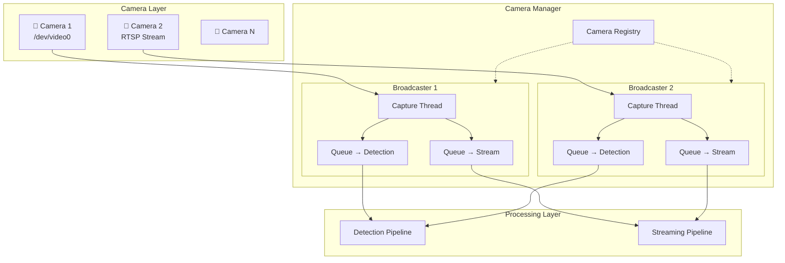

# Camera Manager 多攝影機管理設計草案

> **建立日期：** 2026-01-06
> **狀態：** 草案，待當前系統完成後實作
> **優先級：** 低（Phase 3+）
> **依賴：** 居家監控 App 即時串流功能

---

## 1. 問題背景

### 當前架構的限制

```
當前（單 Camera）：
Camera ──► Capture ──► Processing Layer（緊耦合）
```

| 問題 | 說明 |
|------|------|
| 單 Camera 限制 | 無法動態新增/移除 Camera |
| 緊耦合 | Capture 與 Processing 直接相連 |
| 無法路由 | 無法將不同 Camera 分配給不同 Pipeline |
| Frame 競爭 | 多消費者需共用同一 frame 來源 |

### 目標

- 支援多 Camera 同時運作
- 各 Camera 獨立管理（新增/移除/重啟）
- 多 Pipeline 可訂閱任意 Camera
- Thread-safe 且高效能

---

## 2. 架構設計

### 2.1 系統架構圖



### 2.2 核心概念

| 元件 | 職責 |
|------|------|
| **CameraBroadcaster** | 管理單一 Camera 的 capture 和 frame 廣播 |
| **CameraManager** | 管理所有 Camera，提供統一的 API |
| **Queue** | 每個 Subscriber 獨立的 frame buffer |
| **Frame** | 標準化的 frame 資料結構 |

---

## 3. 核心資料結構

### 3.1 Frame 資料結構

```python
from dataclasses import dataclass
import numpy as np

@dataclass
class Frame:
    """統一的 Frame 資料結構"""
    camera_id: str          # 來源 Camera ID
    timestamp: float        # 擷取時間 (Unix timestamp)
    frame_number: int       # Frame 序號
    data: np.ndarray        # 影像資料 (H, W, C)
    
    @property
    def shape(self) -> tuple[int, int, int]:
        return self.data.shape
```

### 3.2 Camera 狀態

```python
from enum import Enum

class CameraStatus(Enum):
    DISCONNECTED = "disconnected"
    CONNECTING = "connecting"
    RUNNING = "running"
    ERROR = "error"
    STOPPED = "stopped"
```

---

## 4. CameraBroadcaster 實作

```python
import queue
import threading
import time
import cv2
import logging

logger = logging.getLogger(__name__)


class CameraBroadcaster:
    """單一 Camera 的 Frame 廣播器
    
    職責：
    - 持續從 Camera 讀取 frame
    - 廣播 frame 給所有訂閱者
    - 處理訂閱者的新增/移除
    """
    
    def __init__(self, camera_id: str, source: str | int):
        self.camera_id = camera_id
        self.source = source
        self.status = CameraStatus.DISCONNECTED
        
        self._cap: cv2.VideoCapture | None = None
        self._subscribers: dict[str, queue.Queue[Frame]] = {}
        self._lock = threading.Lock()
        self._running = False
        self._thread: threading.Thread | None = None
        self._frame_count = 0
    
    def start(self) -> bool:
        """啟動 Camera capture"""
        if self._running:
            return True
        
        self.status = CameraStatus.CONNECTING
        self._cap = cv2.VideoCapture(self.source)
        
        if not self._cap.isOpened():
            self.status = CameraStatus.ERROR
            logger.error(f"Failed to open camera: {self.camera_id}")
            return False
        
        self._running = True
        self._thread = threading.Thread(
            target=self._capture_loop, 
            daemon=True,
            name=f"Camera-{self.camera_id}"
        )
        self._thread.start()
        self.status = CameraStatus.RUNNING
        logger.info(f"Camera started: {self.camera_id}")
        return True
    
    def stop(self):
        """停止 Camera capture"""
        self._running = False
        if self._thread:
            self._thread.join(timeout=2.0)
        if self._cap:
            self._cap.release()
        self.status = CameraStatus.STOPPED
        logger.info(f"Camera stopped: {self.camera_id}")
    
    def subscribe(
        self, 
        subscriber_id: str, 
        maxsize: int = 10
    ) -> queue.Queue[Frame]:
        """訂閱此 Camera 的 frame stream
        
        Args:
            subscriber_id: 訂閱者識別名稱
            maxsize: Queue 最大容量
        
        Returns:
            用於接收 Frame 的 Queue
        """
        with self._lock:
            if subscriber_id in self._subscribers:
                return self._subscribers[subscriber_id]
            
            q: queue.Queue[Frame] = queue.Queue(maxsize=maxsize)
            self._subscribers[subscriber_id] = q
            logger.debug(f"New subscriber: {subscriber_id} -> {self.camera_id}")
            return q
    
    def unsubscribe(self, subscriber_id: str):
        """取消訂閱"""
        with self._lock:
            if subscriber_id in self._subscribers:
                del self._subscribers[subscriber_id]
                logger.debug(f"Unsubscribed: {subscriber_id} from {self.camera_id}")
    
    def _capture_loop(self):
        """Capture 主迴圈"""
        while self._running:
            if self._cap is None:
                break
                
            ret, frame_data = self._cap.read()
            
            if not ret:
                logger.warning(f"Frame read failed: {self.camera_id}")
                time.sleep(0.1)
                continue
            
            self._frame_count += 1
            frame = Frame(
                camera_id=self.camera_id,
                timestamp=time.time(),
                frame_number=self._frame_count,
                data=frame_data
            )
            
            self._broadcast(frame)
    
    def _broadcast(self, frame: Frame):
        """廣播 frame 給所有訂閱者"""
        with self._lock:
            for sub_id, q in list(self._subscribers.items()):
                try:
                    q.put_nowait(frame)
                except queue.Full:
                    # Queue 滿了，丟棄最舊的 frame（保持即時性）
                    try:
                        q.get_nowait()
                        q.put_nowait(frame)
                    except queue.Empty:
                        pass
    
    @property
    def subscriber_count(self) -> int:
        with self._lock:
            return len(self._subscribers)
    
    @property
    def is_running(self) -> bool:
        return self._running and self.status == CameraStatus.RUNNING
```

---

## 5. CameraManager 實作

```python
class CameraManager:
    """Camera 管理器
    
    職責：
    - 管理多個 CameraBroadcaster
    - 提供統一的 Camera 操作 API
    - 處理 Camera 的生命週期
    """
    
    def __init__(self):
        self._cameras: dict[str, CameraBroadcaster] = {}
        self._lock = threading.Lock()
    
    # ========== Camera 管理 ==========
    
    def add_camera(
        self, 
        camera_id: str, 
        source: str | int,
        auto_start: bool = True
    ) -> bool:
        """新增 Camera
        
        Args:
            camera_id: 唯一識別碼
            source: Camera 來源 (/dev/video0, rtsp://..., 檔案路徑)
            auto_start: 是否自動啟動
        """
        with self._lock:
            if camera_id in self._cameras:
                logger.warning(f"Camera already exists: {camera_id}")
                return False
            
            broadcaster = CameraBroadcaster(camera_id, source)
            self._cameras[camera_id] = broadcaster
            
            if auto_start:
                return broadcaster.start()
            return True
    
    def remove_camera(self, camera_id: str) -> bool:
        """移除 Camera"""
        with self._lock:
            if camera_id not in self._cameras:
                return False
            
            self._cameras[camera_id].stop()
            del self._cameras[camera_id]
            return True
    
    def start_camera(self, camera_id: str) -> bool:
        """啟動指定 Camera"""
        with self._lock:
            if camera_id not in self._cameras:
                return False
            return self._cameras[camera_id].start()
    
    def stop_camera(self, camera_id: str) -> bool:
        """停止指定 Camera（不移除）"""
        with self._lock:
            if camera_id not in self._cameras:
                return False
            self._cameras[camera_id].stop()
            return True
    
    # ========== 訂閱管理 ==========
    
    def subscribe(
        self, 
        camera_id: str, 
        subscriber_id: str, 
        maxsize: int = 10
    ) -> queue.Queue[Frame] | None:
        """訂閱指定 Camera 的 frame stream"""
        with self._lock:
            if camera_id not in self._cameras:
                logger.error(f"Camera not found: {camera_id}")
                return None
            return self._cameras[camera_id].subscribe(subscriber_id, maxsize)
    
    def unsubscribe(self, camera_id: str, subscriber_id: str):
        """取消訂閱"""
        with self._lock:
            if camera_id in self._cameras:
                self._cameras[camera_id].unsubscribe(subscriber_id)
    
    def subscribe_all(
        self, 
        subscriber_id: str, 
        maxsize: int = 10
    ) -> dict[str, queue.Queue[Frame]]:
        """訂閱所有 Camera"""
        with self._lock:
            return {
                cam_id: cam.subscribe(subscriber_id, maxsize)
                for cam_id, cam in self._cameras.items()
            }
    
    # ========== 狀態查詢 ==========
    
    def get_camera_ids(self) -> list[str]:
        """取得所有 Camera ID"""
        with self._lock:
            return list(self._cameras.keys())
    
    def get_camera_status(self, camera_id: str) -> dict | None:
        """取得 Camera 狀態"""
        with self._lock:
            if camera_id not in self._cameras:
                return None
            
            cam = self._cameras[camera_id]
            return {
                "camera_id": camera_id,
                "source": cam.source,
                "status": cam.status.value,
                "is_running": cam.is_running,
                "subscriber_count": cam.subscriber_count,
                "frame_count": cam._frame_count
            }
    
    def get_all_status(self) -> list[dict]:
        """取得所有 Camera 狀態"""
        return [
            self.get_camera_status(cam_id) 
            for cam_id in self.get_camera_ids()
        ]
    
    # ========== 生命週期 ==========
    
    def start_all(self):
        """啟動所有 Camera"""
        for cam_id in self.get_camera_ids():
            self.start_camera(cam_id)
    
    def stop_all(self):
        """停止所有 Camera"""
        for cam_id in self.get_camera_ids():
            self.stop_camera(cam_id)
    
    def shutdown(self):
        """關閉 Manager，釋放所有資源"""
        with self._lock:
            for cam in self._cameras.values():
                cam.stop()
            self._cameras.clear()
```

---

## 6. 使用範例

### 6.1 基本使用

```python
# 初始化
manager = CameraManager()

# 新增 Camera
manager.add_camera("living_room", "/dev/video0")
manager.add_camera("bedroom", "rtsp://192.168.1.100:554/stream")
manager.add_camera("entrance", "/dev/video1")

# 檢查狀態
for status in manager.get_all_status():
    print(f"{status['camera_id']}: {status['status']}")
```

### 6.2 Detection Pipeline 訂閱

```python
# 偵測 Pipeline 只訂閱客廳 Camera
detection_queue = manager.subscribe(
    camera_id="living_room",
    subscriber_id="fall_detection",
    maxsize=20  # 較大 buffer，因為推論耗時
)

def detection_worker():
    while True:
        frame = detection_queue.get()  # 阻塞等待
        result = yolo.detect(frame.data)
        if result.has_fall:
            observer.notify(FallEvent(
                camera_id=frame.camera_id,
                timestamp=frame.timestamp
            ))
```

### 6.3 Streaming Pipeline 訂閱所有 Camera

```python
# 串流 Pipeline 訂閱所有 Camera
stream_queues = manager.subscribe_all(
    subscriber_id="streaming",
    maxsize=5  # 較小 buffer，保持即時性
)

# API: GET /api/cameras/{id}/stream
@app.get("/api/cameras/{camera_id}/stream")
async def stream_camera(camera_id: str):
    if camera_id not in stream_queues:
        raise HTTPException(404, "Camera not found")
    
    q = stream_queues[camera_id]
    
    async def generate():
        while True:
            try:
                frame = q.get(timeout=1.0)
                _, jpeg = cv2.imencode('.jpg', frame.data)
                yield (b'--frame\r\n'
                       b'Content-Type: image/jpeg\r\n\r\n' + 
                       jpeg.tobytes() + b'\r\n')
            except queue.Empty:
                continue
    
    return StreamingResponse(
        generate(), 
        media_type="multipart/x-mixed-replace; boundary=frame"
    )
```

### 6.4 動態管理 Camera

```python
# API: 新增 Camera
@app.post("/api/cameras")
async def add_camera(camera_id: str, source: str):
    success = manager.add_camera(camera_id, source)
    if not success:
        raise HTTPException(400, "Failed to add camera")
    return {"status": "ok", "camera_id": camera_id}

# API: 移除 Camera
@app.delete("/api/cameras/{camera_id}")
async def remove_camera(camera_id: str):
    success = manager.remove_camera(camera_id)
    if not success:
        raise HTTPException(404, "Camera not found")
    return {"status": "ok"}

# API: 取得所有 Camera 狀態
@app.get("/api/cameras")
async def list_cameras():
    return manager.get_all_status()
```

---

## 7. Queue 設計詳解

### 7.1 為什麼每個 Subscriber 需要獨立 Queue？

| 原因 | 說明 |
|------|------|
| **消費速度不同** | Detection 慢（推論），Stream 快（編碼） |
| **Buffer 需求不同** | Detection 需大 buffer，Stream 需小 buffer |
| **解耦** | 一個 Subscriber 卡住不影響其他 |

### 7.2 Queue 滿時的處理策略

```python
# 策略 1: 丟棄最舊 frame（目前採用）
try:
    q.put_nowait(frame)
except queue.Full:
    q.get_nowait()  # 丟棄舊的
    q.put_nowait(frame)

# 策略 2: 丟棄新 frame
try:
    q.put_nowait(frame)
except queue.Full:
    pass  # 直接丟棄

# 策略 3: 阻塞等待（不建議，會拖累 capture）
q.put(frame, block=True, timeout=0.1)
```

### 7.3 Queue Size 建議

| Pipeline 類型 | 建議 Size | 原因 |
|---------------|-----------|------|
| 串流 | 3-5 | 即時性優先 |
| 偵測 | 15-30 | 推論耗時，需 buffer |
| 錄影 | 30-90 | 需要連續 frame |
| 截圖 | 1-2 | 只需最新 frame |

---

## 8. 效能考量

### 8.1 CPU 使用

| Camera 數量 | 預估 CPU 使用 |
|-------------|---------------|
| 1 | 5-10% (decode) + Pipeline |
| 4 | 20-40% (decode) + Pipeline |
| 8+ | 考慮硬體加速 |

### 8.2 記憶體使用

```
單一 1080p frame ≈ 6 MB (1920 × 1080 × 3)
Queue size 10 ≈ 60 MB per subscriber

4 Cameras × 2 Pipelines × 60 MB = 480 MB
```

### 8.3 優化建議

- 使用 `frame.copy()` only when necessary
- 考慮 frame pooling（重用 numpy array）
- 高 Camera 數量時考慮 Shared Memory 方案

---

## 9. 與現有系統的整合

### 9.1 遷移路線

```
Phase 1（當前）：
  Capture ──► Processing

Phase 2（Camera Manager）：
  CameraManager ──► CameraBroadcaster ──► Processing
                                    ──► Streaming

Phase 3（多 Camera）：
  CameraManager ──► Broadcaster[1..N] ──► Processing[1..M]
```

### 9.2 整合點

| 現有元件 | 整合方式 |
|----------|----------|
| `Capture` | 被 `CameraBroadcaster` 取代 |
| `Pipeline` | 從 Queue 消費 Frame |
| `FastAPI` | 新增 Camera 管理和串流 API |
| `Config` | 新增 Camera 配置區塊 |

---

## 10. 配置設計

### config/cameras.yaml

```yaml
cameras:
  - id: "living_room"
    source: "/dev/video0"
    enabled: true
    options:
      width: 1280
      height: 720
      fps: 30
    pipelines:
      - detection
      - streaming
  
  - id: "bedroom"
    source: "rtsp://192.168.1.100:554/stream"
    enabled: true
    pipelines:
      - streaming  # 只串流，不偵測
  
  - id: "entrance"
    source: "/dev/video1"
    enabled: false  # 暫時停用
```

---

## 11. 實作檢查清單

- [ ] 實作 `Frame` dataclass
- [ ] 實作 `CameraStatus` enum
- [ ] 實作 `CameraBroadcaster` 類別
- [ ] 實作 `CameraManager` 類別
- [ ] 新增單元測試
- [ ] 整合 FastAPI Camera 管理 API
- [ ] 整合 Detection Pipeline
- [ ] 整合 Streaming Pipeline
- [ ] 新增配置檔 `config/cameras.yaml`
- [ ] 更新文檔

---

**文檔版本：** 0.1 (草案)
**最後更新：** 2026-01-06
**相關文件：** [居家監控 App 即時串流設計草案](./2026-01-06-home-monitoring-app-draft.md)

**下一步：** 等待當前系統完成後再進入詳細設計
