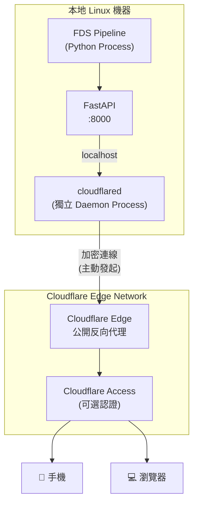
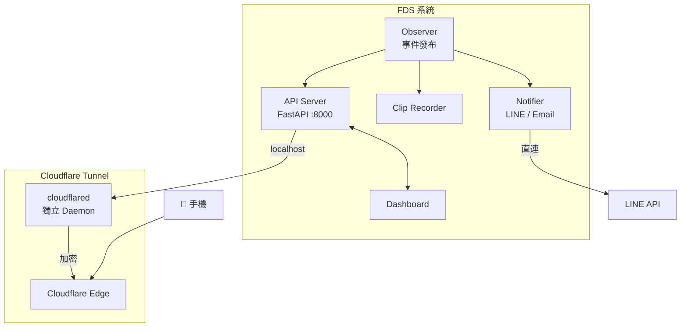

# Cloudflare Tunnel 整合設計文檔

> **建立日期：** 2026-01-06
> **狀態：** 設計完成，待實作
> **目標：** 實現手機/外網安全存取本地 Dashboard

---

## 1. 專案概述

### 背景

FDS (Fall Detection System) 的 Dashboard 目前運行在本地 Linux 機器上，只能透過 `localhost:8000` 存取。
為了讓用戶能從手機或外網遠端存取 Dashboard，需要將本地服務安全地暴露到公開網域。

### 目標

- ✅ 遠端存取 Dashboard（手機、瀏覽器）
- ✅ 不開放任何本地 port（零暴露面）
- ✅ 加密傳輸（HTTPS）
- ✅ 可選身份驗證（Cloudflare Access）
- ❌ 不傳輸隱私影像（影片仍保留本地）

### 為什麼選擇 Cloudflare Tunnel？

| 特性 | Ngrok (免費) | Cloudflare Tunnel (免費) |
|------|--------------|--------------------------|
| **固定域名** | ❌ 每次重啟會變 | ✅ 永久固定 |
| **HTTPS** | ✅ | ✅ 含 Cloudflare SSL |
| **頻寬限制** | 有限制 | ✅ 無限制 |
| **DDoS 防護** | ❌ | ✅ 內建 |
| **Access 認證** | ❌ 需自建 | ✅ 零信任整合 |
| **需要域名** | ❌ | ⚠️ 需要（可用便宜域名） |

---

## 2. 架構設計

### 2.1 系統架構圖



### 2.2 關鍵設計決策

#### Q: cloudflared 是獨立 Process 嗎？

**是的**，cloudflared 是一個獨立的 Daemon Process，與 FDS Python 應用完全分離。

| 元件 | 類型 | 說明 |
|------|------|------|
| **FDS** | Python Process | FastAPI 應用，運行在 `:8000` |
| **cloudflared** | Go Binary (Daemon) | Cloudflare 提供的獨立程式 |

兩者透過 `localhost:8000` 溝通，cloudflared 只負責轉發 HTTP 請求。

#### Q: Cloudflare Edge Network 是公開網域嗎？

**是的**，Cloudflare Edge Network 是公開可存取的。

```
連線流程：
1. 手機訪問 https://fds.your-domain.com
2. DNS 解析 → 指向 Cloudflare Edge (104.x.x.x)
3. Cloudflare Edge 透過「預先建立的加密通道」轉發給你的 cloudflared
4. cloudflared 轉發給 localhost:8000 (FastAPI)
5. 回應原路返回
```

**安全性關鍵：**
- 你的本地機器**不開放任何 port**
- 連線方向是「由內向外」（你主動連到 Cloudflare）
- 外部無法直接掃描或連線你的機器

#### Q: 需要先建立 Tunnel 才能讓外部存取嗎？

**是的**，cloudflared daemon 必須先運行並建立到 Cloudflare 的加密通道，外部才能透過域名存取 Dashboard。

```
時間軸：
1. 啟動 FDS (FastAPI :8000)     ← 本地可存取
2. 啟動 cloudflared daemon       ← 建立加密通道
3. Tunnel 連線成功               ← 外部才能存取
4. 手機存取 fds.your-domain.com  ← OK ✅

如果 cloudflared 沒運行：
→ 手機存取 → Cloudflare 找不到 Tunnel → 502 錯誤 ❌
```

---

## 3. 前置需求

| 需求 | 說明 |
|------|------|
| Cloudflare 帳號 | 免費註冊 [cloudflare.com](https://cloudflare.com) |
| 擁有域名 | 需託管在 Cloudflare DNS |
| Linux 機器 | FDS 運行環境 |

> [!NOTE]
> 如果還沒有域名，可以購買便宜的 `.xyz` 或 `.site` 域名（約 $1-3/年）。

---

## 4. 實作步驟

### Phase 1: 安裝 cloudflared

```bash
# 方法 A: 使用官方 apt repository（推薦）
curl -fsSL https://pkg.cloudflare.com/cloudflare-main.gpg | sudo tee /usr/share/keyrings/cloudflare-main.gpg >/dev/null
echo 'deb [signed-by=/usr/share/keyrings/cloudflare-main.gpg] https://pkg.cloudflare.com/cloudflared any main' | sudo tee /etc/apt/sources.list.d/cloudflared.list
sudo apt update && sudo apt install cloudflared

# 方法 B: 直接下載 binary
curl -L https://github.com/cloudflare/cloudflared/releases/latest/download/cloudflared-linux-amd64 -o cloudflared
chmod +x cloudflared
sudo mv cloudflared /usr/local/bin/

# 驗證安裝
cloudflared --version
```

---

### Phase 2: 登入 Cloudflare

```bash
cloudflared tunnel login
```

執行後：
1. 瀏覽器自動開啟 Cloudflare 授權頁面
2. 選擇你的域名並授權
3. 憑證自動儲存到 `~/.cloudflared/cert.pem`

---

### Phase 3: 建立 Tunnel

```bash
# 建立名為 fds-tunnel 的 tunnel
cloudflared tunnel create fds-tunnel

# 輸出範例：
# Created tunnel fds-tunnel with id xxxxxxxx-xxxx-xxxx-xxxx-xxxxxxxxxxxx
```

> [!IMPORTANT]
> 記下輸出的 **Tunnel ID**，後續設定需要使用。

---

### Phase 4: 設定 DNS 路由

```bash
# 將 tunnel 綁定到子域名
cloudflared tunnel route dns fds-tunnel fds.your-domain.com

# 這會自動在 Cloudflare DNS 建立 CNAME 記錄：
# fds.your-domain.com → xxxxxxxx-xxxx-xxxx-xxxx-xxxxxxxxxxxx.cfargotunnel.com
```

---

### Phase 5: 建立設定檔

#### [NEW] config/cloudflared.yml

```yaml
# Cloudflare Tunnel 設定檔
# 位置: /home/<user>/Projects/FDS/config/cloudflared.yml

tunnel: <YOUR_TUNNEL_ID>  # 替換為 Phase 3 的 Tunnel ID
credentials-file: /home/<user>/.cloudflared/<TUNNEL_ID>.json

ingress:
  # Dashboard 主入口
  - hostname: fds.your-domain.com
    service: http://localhost:8000
  
  # 必須有 catch-all 規則
  - service: http_status:404
```

> [!CAUTION]
> `cloudflared.yml` 包含敏感的 Tunnel ID，務必加入 `.gitignore`：
> ```
> # .gitignore
> config/cloudflared.yml
> .cloudflared/
> ```

---

### Phase 6: 測試運行

```bash
# 確保 FDS 正在運行
uv run python main.py &

# 測試 tunnel 連線（前景執行）
cloudflared tunnel --config /home/<user>/Projects/FDS/config/cloudflared.yml run

# 成功後，用瀏覽器或手機存取：
# https://fds.your-domain.com
```

---

### Phase 7: 設定 Systemd 自動啟動

#### [NEW] /etc/systemd/system/cloudflared.service

```ini
[Unit]
Description=Cloudflare Tunnel for FDS Dashboard
After=network.target

[Service]
Type=simple
User=<your-username>
ExecStart=/usr/local/bin/cloudflared tunnel --config /home/<user>/Projects/FDS/config/cloudflared.yml run
Restart=on-failure
RestartSec=5
StandardOutput=journal
StandardError=journal

[Install]
WantedBy=multi-user.target
```

```bash
# 安裝 service
sudo systemctl daemon-reload
sudo systemctl enable cloudflared
sudo systemctl start cloudflared

# 檢查狀態
sudo systemctl status cloudflared
journalctl -u cloudflared -f
```

---

## 5. Docker 整合（可選）

如果 FDS 使用 Docker Compose 部署，可以將 cloudflared 加入容器編排。

### 5.1 使用 Tunnel Token（推薦）

在 Cloudflare Zero Trust Dashboard 建立 Tunnel Token：
1. 進入 **Zero Trust** → **Networks** → **Tunnels**
2. 點擊你的 tunnel → **Configure**
3. 複製 **Tunnel Token**

#### [MODIFY] docker-compose.yml

```yaml
services:
  # 現有的 FDS 服務
  app:
    build: .
    ports:
      - "8000:8000"
    # ... 其他設定 ...

  # 新增 cloudflared 服務
  cloudflared:
    image: cloudflare/cloudflared:latest
    container_name: fds-tunnel
    restart: unless-stopped
    command: tunnel run
    environment:
      - TUNNEL_TOKEN=${CLOUDFLARE_TUNNEL_TOKEN}
    depends_on:
      - app
    networks:
      - fds-network

networks:
  fds-network:
    driver: bridge
```

#### [MODIFY] .env

```bash
# 新增 Cloudflare Tunnel Token
CLOUDFLARE_TUNNEL_TOKEN=your-tunnel-token-here
```

> [!IMPORTANT]
> 使用容器時，`service` 需改為 `http://app:8000`（容器名稱），而非 `localhost`。

---

## 6. Cloudflare Access 認證（可選）

為 Dashboard 加上額外的登入保護層（零信任驗證）。

### 設定步驟

1. 進入 **Cloudflare Zero Trust** → **Access** → **Applications**
2. 點擊 **Add an application** → **Self-hosted**
3. 設定：
   - Application name: `FDS Dashboard`
   - Session duration: `24 hours`
   - Application domain: `fds.your-domain.com`
4. 設定 Policy（誰可以存取）：
   - Policy name: `Allow Admin`
   - Action: `Allow`
   - Include: `Emails` → 輸入你的 email

### 驗證效果

存取 `https://fds.your-domain.com` 時：
1. Cloudflare 攔截請求
2. 顯示 email 驗證頁面
3. 輸入 email → 收到 OTP → 輸入 OTP
4. 驗證成功 → 進入 Dashboard

---

## 7. 安全注意事項

> [!IMPORTANT]
> **不要**在公開 URL 暴露以下端點（除非有認證）：
> - 影片串流端點（隱私風險）
> - 管理 API（如刪除事件）
> - 設定修改 API

> [!CAUTION]
> 以下檔案包含敏感資訊，**必須**加入 `.gitignore`：
> ```gitignore
> # Cloudflare Tunnel
> .cloudflared/
> config/cloudflared.yml
> ```

### CORS 設定

如果 Dashboard 前端與 API 分離，確保 FastAPI 有適當的 CORS 設定：

```python
from fastapi.middleware.cors import CORSMiddleware

app.add_middleware(
    CORSMiddleware,
    allow_origins=["https://fds.your-domain.com"],
    allow_credentials=True,
    allow_methods=["*"],
    allow_headers=["*"],
)
```

---

## 8. 驗證計劃

### 開發環境驗證

| 測試項目 | 指令/方法 | 預期結果 |
|----------|----------|----------|
| cloudflared 安裝 | `cloudflared --version` | 顯示版本號 |
| Tunnel 建立 | `cloudflared tunnel list` | 顯示 fds-tunnel |
| 本地 API 存取 | `curl localhost:8000/health` | 回應 OK |
| Tunnel 連線 | `cloudflared tunnel run` | 顯示 "Registered connectors" |
| 外部存取 | 瀏覽器開 `https://fds.your-domain.com` | Dashboard 載入成功 |

### 生產環境驗證

| 測試項目 | 方法 | 預期結果 |
|----------|------|----------|
| Systemd 服務 | `sudo systemctl status cloudflared` | Active (running) |
| 開機自啟 | 重啟機器後檢查 | cloudflared 自動運行 |
| 手機存取 | 用 4G 網路存取 Dashboard | 載入成功 |
| Access 認證 | 存取時要求 email 驗證 | 驗證後才能進入 |

---

## 9. 故障排除

### 常見問題

| 問題 | 可能原因 | 解決方法 |
|------|----------|----------|
| 502 Bad Gateway | FDS 沒運行 | 確保 FastAPI 在 `:8000` 運行 |
| 502 Bad Gateway | cloudflared 沒運行 | 執行 `cloudflared tunnel run` |
| DNS 解析失敗 | DNS 尚未生效 | 等待 5 分鐘或清除 DNS 快取 |
| 認證失敗 | `cert.pem` 過期 | 重新執行 `cloudflared tunnel login` |

### 檢查指令

```bash
# 檢查 FDS 是否運行
curl -s localhost:8000/health

# 檢查 cloudflared 服務狀態
sudo systemctl status cloudflared

# 查看 cloudflared 日誌
journalctl -u cloudflared -f

# 測試 DNS 解析
nslookup fds.your-domain.com

# 檢查 tunnel 連線狀態
cloudflared tunnel info fds-tunnel
```

---

## 10. 實作檢查清單

### 基礎設定

- [ ] 安裝 `cloudflared`
- [ ] 執行 `cloudflared tunnel login` 完成授權
- [ ] 建立 tunnel：`cloudflared tunnel create fds-tunnel`
- [ ] 設定 DNS 路由：`cloudflared tunnel route dns fds-tunnel fds.your-domain.com`
- [ ] 建立設定檔：`config/cloudflared.yml`
- [ ] 更新 `.gitignore` 排除敏感檔案

### 生產部署

- [ ] 測試 tunnel 連線成功
- [ ] 設定 Systemd 服務
- [ ] 驗證開機自動啟動
- [ ] （可選）設定 Cloudflare Access 認證
- [ ] （可選）Docker Compose 整合

### 驗證

- [ ] 本地存取 `localhost:8000` 正常
- [ ] 外網存取 `https://fds.your-domain.com` 正常
- [ ] 手機行動網路存取正常
- [ ] （如有）Access 認證運作正常

---

## 11. 與現有架構的整合

### 架構關係圖



### 關鍵分離

| 元件 | 經過 Tunnel？ | 說明 |
|------|---------------|------|
| **Dashboard 存取** | ✅ 是 | 外部透過 Cloudflare 存取 |
| **LINE 通知** | ❌ 否 | Notifier 直接 POST 到 LINE API |
| **Email 通知** | ❌ 否 | Notifier 直接連 SMTP |
| **影片儲存** | ❌ 否 | ClipRec 僅存本地 |

**LINE/Email Notifier 完全不需要 Tunnel**，它們直接訂閱 Observer 的事件並發送通知。

---

## 12. 參考資料

### Cloudflare 官方文檔

- [Cloudflare Tunnel 快速入門](https://developers.cloudflare.com/cloudflare-one/connections/connect-networks/)
- [cloudflared 安裝指南](https://developers.cloudflare.com/cloudflare-one/connections/connect-networks/downloads/)
- [Cloudflare Access](https://developers.cloudflare.com/cloudflare-one/policies/access/)
- [Tunnel 與 Docker](https://developers.cloudflare.com/cloudflare-one/connections/connect-networks/deploy-tunnels/deploy-cloudflared-docker/)

### 替代方案

- [Tailscale](https://tailscale.com/) - VPN 方案，需要客戶端安裝
- [Ngrok](https://ngrok.com/) - 類似服務，但免費版限制多

---

**文檔版本：** 1.0
**最後更新：** 2026-01-06
**作者：** AI Assistant

**下一步：** 購買域名並託管到 Cloudflare，然後按 Phase 1-7 逐步實作。
