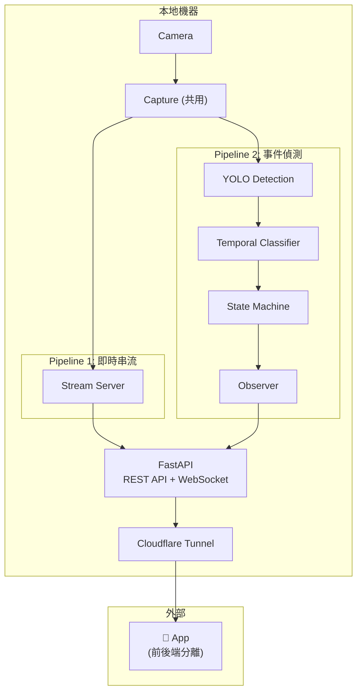
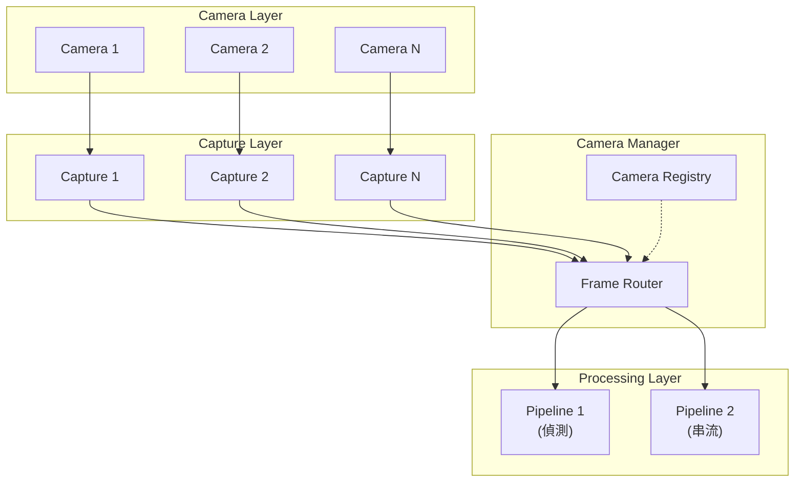

# 居家監控 App 即時串流設計草案

> **建立日期：** 2026-01-06
> **狀態：** 草案，待當前系統完成後實作
> **優先級：** 低（Phase 3+）
> **目標：** 實現 24/7 即時影像監控 + 事件通知的前後端分離架構

---

## 1. 需求背景

### 客戶需求

- 在手機 App 上 **24/7 查看居家即時影像**
- 同時保留現有的 **跌倒偵測與事件通知** 功能
- 前端先以 **App** 為目標（非 Web）

### 隱私取捨

> [!WARNING]
> 此功能會讓 **原始影像經過網路傳輸**（透過 Cloudflare Tunnel）。
> 客戶已接受此隱私風險以換取遠端監控便利性。

---

## 2. 架構設計

### 2.1 雙管線架構



### 2.2 設計原則

| 原則 | 說明 |
|------|------|
| **關注點分離** | 串流與偵測各自獨立 Pipeline |
| **計算本地化** | AI 模型推論在 Edge 端執行 |
| **前後端分離** | App 透過 REST API + WebSocket 通訊 |
| **共用 Capture** | 兩條 Pipeline 共用 Camera 資源 |

---

## 3. API 設計

### 3.1 REST API 端點

```yaml
# 即時串流
GET  /api/stream                 # MJPEG 影像串流
GET  /api/stream/snapshot        # 單張截圖

# 事件管理
GET  /api/events                 # 事件列表（分頁）
GET  /api/events/{id}            # 事件詳情
GET  /api/events/{id}/clip       # 事件影片串流
DELETE /api/events/{id}          # 刪除事件

# 系統狀態
GET  /api/status                 # 系統健康狀態
GET  /api/stats                  # 統計資訊（今日事件數、運行時間等）

# 設定
GET  /api/settings               # 取得設定
PUT  /api/settings               # 更新設定（通知開關等）
```

### 3.2 WebSocket 端點

```yaml
WS   /api/ws/events              # 即時事件推播
# 事件格式:
# {
#   "type": "fall_detected",
#   "event_id": "evt_1234567890",
#   "confidence": 0.92,
#   "timestamp": "2026-01-06T16:30:00+08:00"
# }

WS   /api/ws/status              # 系統狀態變更推播（可選）
```

### 3.3 App 端互動流程

```
┌─────────────────────────────────────────────────────────┐
│                      App 啟動                           │
└─────────────────────────────────────────────────────────┘
                          │
                          ▼
                 GET /api/status
                 確認系統在線
                          │
          ┌───────────────┴───────────────┐
          ▼                               ▼
   GET /api/stream              WS /api/ws/events
   顯示即時畫面                  訂閱事件通知
          │                               │
          ▼                               ▼
   ┌─────────────┐               ┌─────────────────┐
   │ 即時監控頁面 │               │ 收到事件推播     │
   │             │               │      │          │
   └─────────────┘               │      ▼          │
                                 │ 顯示通知彈窗    │
                                 │      │          │
                                 │      ▼          │
                                 │ 跳轉事件詳情    │
                                 └─────────────────┘
```

---

## 4. 技術選型

### 4.1 即時串流技術

| 技術 | 延遲 | 複雜度 | 建議 |
|------|------|--------|------|
| **MJPEG over HTTP** | 200-500ms | 低 | ✅ Phase 1 採用 |
| **WebSocket + Binary** | 100-300ms | 中 | Phase 2 優化 |
| **WebRTC** | <100ms | 高 | 未來升級 |
| **HLS/DASH** | 5-30s | 中 | 不適合即時監控 |

### 4.2 App 開發框架（待決定）

| 框架 | 優點 | 缺點 |
|------|------|------|
| **Flutter** | 跨平台、效能好 | Dart 學習曲線 |
| **React Native** | JS 生態、跨平台 | 效能略遜 |
| **Swift (iOS)** | 原生效能 | 需單獨開發 Android |
| **Kotlin (Android)** | 原生效能 | 需單獨開發 iOS |

### 4.3 推播通知

| 技術 | 適用場景 |
|------|----------|
| **WebSocket** | App 前景時即時推播 |
| **Firebase Cloud Messaging** | App 背景時推播 |
| **LINE Notify** | 備援通知管道（現有） |

---

## 5. 實作要點

### 5.1 Capture 共用機制

```python
# 兩條 Pipeline 共用 Camera，需要同步機制
class SharedCapture:
    def __init__(self, source):
        self.cap = cv2.VideoCapture(source)
        self.frame = None
        self.lock = threading.Lock()
        self._start_capture_thread()
    
    def get_frame(self) -> np.ndarray | None:
        with self.lock:
            return self.frame.copy() if self.frame is not None else None
    
    def _capture_loop(self):
        while self.running:
            ret, frame = self.cap.read()
            if ret:
                with self.lock:
                    self.frame = frame
```

### 5.2 MJPEG 串流實作

```python
from fastapi import FastAPI
from fastapi.responses import StreamingResponse

@app.get("/api/stream")
async def video_stream():
    async def generate():
        while True:
            frame = shared_capture.get_frame()
            if frame is not None:
                _, jpeg = cv2.imencode('.jpg', frame, [cv2.IMWRITE_JPEG_QUALITY, 70])
                yield (b'--frame\r\n'
                       b'Content-Type: image/jpeg\r\n\r\n' + 
                       jpeg.tobytes() + b'\r\n')
            await asyncio.sleep(1/30)  # 30fps
    
    return StreamingResponse(
        generate(), 
        media_type="multipart/x-mixed-replace; boundary=frame"
    )
```

### 5.3 WebSocket 事件推播

```python
from fastapi import WebSocket

class EventBroadcaster:
    def __init__(self):
        self.connections: list[WebSocket] = []
    
    async def connect(self, ws: WebSocket):
        await ws.accept()
        self.connections.append(ws)
    
    async def broadcast(self, event: dict):
        for ws in self.connections:
            await ws.send_json(event)

# Observer 觸發時呼叫
async def on_event_confirmed(event):
    await broadcaster.broadcast({
        "type": "fall_detected",
        "event_id": event.id,
        "confidence": event.confidence,
        "timestamp": event.timestamp.isoformat()
    })
```

---

## 6. 頻寬與效能考量

### 6.1 頻寬估算

| 解析度 | 幀率 | JPEG 品質 | 預估頻寬 |
|--------|------|-----------|----------|
| 720p | 30fps | 70% | 2-3 Mbps |
| 720p | 15fps | 70% | 1-1.5 Mbps |
| 1080p | 30fps | 70% | 4-6 Mbps |
| 1080p | 15fps | 50% | 1.5-2.5 Mbps |

### 6.2 建議：提供畫質選項

```yaml
GET /api/stream?quality=high   # 1080p, 30fps
GET /api/stream?quality=medium # 720p, 30fps
GET /api/stream?quality=low    # 720p, 15fps
```

---

## 7. 安全考量

> [!IMPORTANT]
> 即時串流端點必須有認證保護，避免未授權存取。

### 建議措施

- **Cloudflare Access**：存取前需 email OTP 驗證
- **API Token**：App 需帶 Bearer Token 存取 API
- **Rate Limiting**：防止濫用
- **HTTPS Only**：所有通訊加密

---

## 8. 實作檢查清單

### Phase 1：基礎串流

- [ ] 實作 `SharedCapture` 共用機制
- [ ] 實作 `/api/stream` MJPEG 端點
- [ ] 實作 `/api/stream/snapshot` 截圖端點
- [ ] 測試 Cloudflare Tunnel 串流相容性
- [ ] 效能調優（JPEG 壓縮率、幀率）

### Phase 2：WebSocket 推播

- [ ] 實作 `EventBroadcaster`
- [ ] 實作 `/api/ws/events` WebSocket 端點
- [ ] Observer 整合 WebSocket 推播
- [ ] App 端 WebSocket 連線處理

### Phase 3：App 開發

- [ ] 決定 App 開發框架
- [ ] 設計 UI/UX
- [ ] 實作即時串流播放器
- [ ] 實作事件列表與詳情頁
- [ ] 實作推播通知處理

### Phase 4：優化

- [ ] 畫質自適應
- [ ] 背景推播（FCM）
- [ ] 離線快取
- [ ] WebRTC 升級（可選）

---

## 9. 與現有系統的整合點

| 現有元件 | 整合方式 |
|----------|----------|
| `Capture` | 升級為 `SharedCapture`，支援多 Pipeline 消費 |
| `Observer` | 新增 WebSocket 推播訂閱者 |
| `FastAPI` | 新增串流與 WebSocket 端點 |
| `Cloudflare Tunnel` | 無需修改，原生支援 |
| `LINE Notifier` | 保留作為備援通知 |

---

## 10. 待決定事項

| 項目 | 選項 | 決定者 |
|------|------|--------|
| App 開發框架 | Flutter / React Native / Native | 團隊 |
| 串流初始解析度 | 720p / 1080p | 客戶/效能測試 |
| 背景推播服務 | FCM / APNs / 自建 | 團隊 |
| 認證機制 | Cloudflare Access / JWT / 兩者 | 團隊 |
| Capture 共用方案 | Ring Buffer / Broadcaster / Shared Memory | 團隊 |

---

## 11. Capture 共用方案深入分析

### 11.1 問題描述

兩條 Pipeline 共用同一個 Camera 會產生以下問題：

| 問題 | 說明 |
|------|------|
| **Frame 競爭** | 兩者同時 `cap.read()` 會拿到不同 frame |
| **幀率不匹配** | 串流需 30fps，偵測可能只需 15fps |
| **阻塞** | 偵測推論耗時會阻塞串流 |
| **異常擴散** | 一方關閉 Camera 影響另一方 |

### 11.2 方案比較

#### 方案 A：Ring Buffer（推薦）

```
Camera ──► Capture Thread ──► Ring Buffer (共用)
                                   │
                   ┌───────────────┼───────────────┐
                   ▼               ▼               ▼
             Pipeline 1      Pipeline 2       (未來...)
```

```python
from collections import deque
import threading

class FrameProducer:
    def __init__(self, source, buffer_size=30):
        self.cap = cv2.VideoCapture(source)
        self.buffer = deque(maxlen=buffer_size)
        self.lock = threading.Lock()
        self.running = True
        self.thread = threading.Thread(target=self._capture_loop, daemon=True)
        self.thread.start()
    
    def _capture_loop(self):
        while self.running:
            ret, frame = self.cap.read()
            if ret:
                with self.lock:
                    self.buffer.append((time.time(), frame))
    
    def get_latest_frame(self):
        with self.lock:
            return self.buffer[-1] if self.buffer else (None, None)
```

| 優點 | 缺點 |
|------|------|
| 實作簡單 | 兩者處理同一批 frame |
| 低延遲 | buffer 需要記憶體 |
| 不互相阻塞 | |

---

#### 方案 B：Frame Broadcaster（發布-訂閱）

```
Camera ──► Capture ──► Broadcaster
                           │
              ┌────────────┼────────────┐
              ▼            ▼            ▼
         Subscriber    Subscriber   Subscriber
```

```python
import queue

class FrameBroadcaster:
    def __init__(self, source):
        self.cap = cv2.VideoCapture(source)
        self.subscribers: dict[str, queue.Queue] = {}
        self.running = True
        self._start_thread()
    
    def subscribe(self, name: str, maxsize: int = 5) -> queue.Queue:
        q = queue.Queue(maxsize=maxsize)
        self.subscribers[name] = q
        return q
    
    def _capture_loop(self):
        while self.running:
            ret, frame = self.cap.read()
            if ret:
                for q in self.subscribers.values():
                    try:
                        q.put_nowait((time.time(), frame.copy()))
                    except queue.Full:
                        q.get_nowait()  # 丟棄舊 frame
                        q.put_nowait((time.time(), frame.copy()))
```

| 優點 | 缺點 |
|------|------|
| 完全解耦 | 每訂閱者需 `frame.copy()` |
| 可動態新增 Pipeline | 記憶體消耗較大 |
| 各自獨立 buffer | |

---

#### 方案 C：Shared Memory（高效能）

```
Main Process ──► Capture ──► Shared Memory (mmap)
                                   │
                   ┌───────────────┼───────────────┐
                   ▼               ▼               ▼
              Process 1       Process 2       Process 3
```

```python
from multiprocessing import shared_memory, Lock, Value

class SharedFrameBuffer:
    def __init__(self, width, height, channels=3):
        self.shape = (height, width, channels)
        self.size = width * height * channels
        self.shm = shared_memory.SharedMemory(create=True, size=self.size)
        self.frame = np.ndarray(self.shape, dtype=np.uint8, buffer=self.shm.buf)
        self.lock = Lock()
        self.timestamp = Value('d', 0.0)
    
    def write(self, frame):
        with self.lock:
            np.copyto(self.frame, frame)
            self.timestamp.value = time.time()
    
    def read(self):
        with self.lock:
            return self.timestamp.value, self.frame.copy()
```

| 優點 | 缺點 |
|------|------|
| 零拷貝、高效能 | 實作複雜 |
| 進程隔離（容錯） | 需要 IPC 協調 |
| 充分利用多核 | Debug 困難 |

### 11.3 建議

| 階段 | 推薦方案 |
|------|----------|
| **Phase 1（驗證）** | 方案 A: Ring Buffer |
| **Phase 2（擴展）** | 方案 B: Broadcaster |
| **Phase 3（高效能）** | 方案 C: Shared Memory |

---

## 12. 多 Camera 擴展架構

### 12.1 問題分析

當系統需要支援多個 Camera 時：

| 問題 | 說明 |
|------|------|
| 需要多個 Capture 實例？ | ✅ 是的，每個 Camera 需要獨立的 Capture |
| 需要多個 Pipeline？ | ⚠️ 取決於設計，可共用或獨立 |
| 當前架構能擴展嗎？ | ⚠️ 需要重構，加入 Camera Manager 層 |

### 12.2 當前架構的問題

```
當前架構（單 Camera）：
Camera ──► Capture ──► Processing Layer（直接相連）
```

**問題：**
- Capture 與 Processing Layer **緊耦合**
- 無法動態新增/移除 Camera
- 無法路由多 Camera 到同一個或不同 Pipeline

### 12.3 優化建議：Camera Manager 層



### 12.4 Camera Manager 設計

```python
class CameraManager:
    def __init__(self):
        self.captures: dict[str, FrameBroadcaster] = {}
        self.pipelines: dict[str, list[str]] = {}  # pipeline -> [camera_ids]
    
    def add_camera(self, camera_id: str, source: str):
        broadcaster = FrameBroadcaster(source)
        self.captures[camera_id] = broadcaster
    
    def remove_camera(self, camera_id: str):
        if camera_id in self.captures:
            self.captures[camera_id].stop()
            del self.captures[camera_id]
    
    def subscribe(self, camera_id: str, pipeline_name: str) -> queue.Queue:
        return self.captures[camera_id].subscribe(pipeline_name)
    
    def get_all_cameras(self) -> list[str]:
        return list(self.captures.keys())

# 使用範例
manager = CameraManager()
manager.add_camera("cam_living_room", "/dev/video0")
manager.add_camera("cam_bedroom", "rtsp://192.168.1.100/stream")

# 偵測 Pipeline 訂閱客廳攝影機
detection_queue = manager.subscribe("cam_living_room", "detection")

# 串流 Pipeline 可以訂閱任意攝影機
stream_queue_1 = manager.subscribe("cam_living_room", "stream")
stream_queue_2 = manager.subscribe("cam_bedroom", "stream")
```

### 12.5 多 Camera API 設計

```yaml
# 多 Camera 串流
GET /api/cameras                        # 取得所有 Camera 列表
GET /api/cameras/{id}/stream            # 指定 Camera 串流
GET /api/cameras/{id}/snapshot          # 指定 Camera 截圖

# 多 Camera 事件
GET /api/events?camera_id=cam_bedroom   # 依 Camera 篩選事件
```

### 12.6 架構演進路線

```
Phase 1（當前）：單 Camera
Capture ──► Processing

Phase 2（雙管線）：單 Camera + 多 Pipeline
Capture ──► Broadcaster ──► Processing
                       ──► Streaming

Phase 3（多 Camera）：多 Camera + 多 Pipeline
Camera Manager ──► Broadcaster ──► Processing
                              ──► Streaming
```

---

**文檔版本：** 0.2 (草案)
**最後更新：** 2026-01-06
**變更歷史：**
- v0.1: 初始草案
- v0.2: 新增 Capture 共用方案分析、多 Camera 擴展架構

**下一步：** 等待當前系統完成後再進入詳細設計

