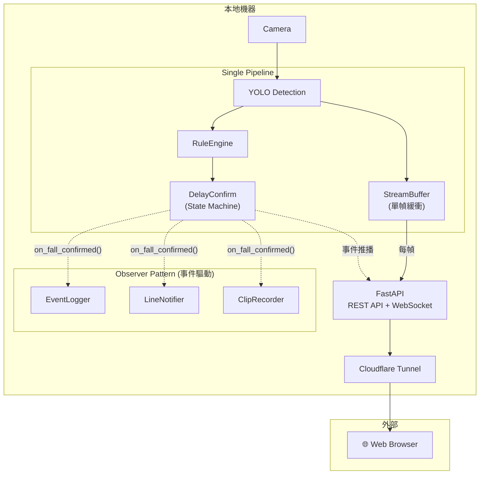

> **建立日期：** 2026-01-06
> **更新日期：** 2026-01-12
> **狀態：** 草案，待當前系統完成後實作
> **優先級：** 低（Phase 3+）
> **目標：** 實現 24/7 即時影像監控 + 事件通知的前後端分離架構

---

## 1. 需求背景

### 客戶需求

- 在 Web/App 上 **24/7 查看居家即時影像**（原始畫面，不需偵測框）
- 同時保留現有的 **跌倒偵測與事件通知** 功能
- 前端先以 **Web** 為目標，後續再考慮 App
- 透過 **Cloudflare Tunnel** 支援遠端存取

### 設計決策

| 項目      | 決策                   | 理由                          |
| --------- | ---------------------- | ----------------------------- |
| 串流畫面  | 原始影像（無偵測框）   | 簡化架構，不需 Annotator      |
| 延遲/畫質 | 平衡型（1-2 秒，720p） | 符合監控場景需求              |
| 網路存取  | Cloudflare Tunnel      | HTTP/HTTPS 通道，安全且易部署 |

### 隱私取捨

> [!WARNING]
> 此功能會讓 **原始影像經過網路傳輸**（透過 Cloudflare Tunnel）。
> 客戶已接受此隱私風險以換取遠端監控便利性。

---

## 2. 架構設計

### 2.1 單管線 + StreamBuffer 架構

核心設計理念：**串流與偵測共用同一條管線**，透過 StreamBuffer 將 frame 提供給 FastAPI endpoint。



### 2.2 資料流說明

```
while running:
    frame = camera.read()

    # 1. Detection（與現有邏輯相同）
    detections = detector.detect(frame)

    # 2. 推送給 StreamBuffer（每幀，非阻塞）
    stream_buffer.push(frame)

    # 3. 跌倒判斷（現有邏輯不變）
    is_fallen = rule_engine.is_fallen(detections)
    state = delay_confirm.update(is_fallen, current_time)
    # ↑ 內部會觸發 Observer（事件驅動，非每幀）
```

### 2.3 設計原則

| 原則              | 說明                                                    |
| ----------------- | ------------------------------------------------------- |
| **單管線設計**    | 串流與偵測在同一條管線，frame 順序一致                  |
| **職責分離**      | StreamBuffer 負責串流，Observer 負責事件                |
| **非阻塞串流**    | StreamBuffer 採用覆蓋策略，不阻塞主迴圈                 |
| **Observer 不變** | 現有的 EventLogger、LineNotifier、ClipRecorder 保持不變 |

---

## 3. StreamBuffer 設計

### 3.1 核心概念

StreamBuffer 是一個 **Thread-safe 單幀緩衝**，用於將最新 frame 提供給 FastAPI streaming endpoint。

**設計選擇：單幀緩衝 vs Ring Buffer**

| 方案                 | 優點                         | 缺點                     |
| -------------------- | ---------------------------- | ------------------------ |
| **單幀緩衝（採用）** | 最簡單、記憶體最小、總是最新 | 可能掉幀（人眼感知不出） |
| Ring Buffer          | 有緩衝餘裕                   | 較複雜、可能延遲         |

對於 15fps 的監控串流，偶爾掉幀不影響體驗，因此採用最簡單的單幀緩衝。

### 3.2 實作

```python
# src/capture/stream_buffer.py
import threading
import numpy as np


class StreamBuffer:
    """Thread-safe single-frame buffer for streaming."""

    def __init__(self):
        self._frame: np.ndarray | None = None
        self._lock = threading.Lock()

    def push(self, frame: np.ndarray) -> None:
        """Update the latest frame (non-blocking, overwrites old frame)."""
        with self._lock:
            self._frame = frame  # 不需 copy，因為 camera.read() 每次都是新 frame

    def get(self) -> np.ndarray | None:
        """Get the latest frame (returns copy to avoid race condition)."""
        with self._lock:
            return self._frame.copy() if self._frame is not None else None
```

### 3.3 整合到 main.py

```python
from src.capture.stream_buffer import StreamBuffer

# === Component Creation ===
stream_buffer = StreamBuffer()

# === Main Loop ===
while running:
    frame = camera.read()
    if frame is None:
        continue

    current_time = time.time()
    detections = detector.detect(frame)

    # 推送給串流（新增）
    stream_buffer.push(frame)

    # 以下不變
    is_fallen = rule_engine.is_fallen(detections)
    state = delay_confirm.update(is_fallen, current_time)
```

---

## 4. API 設計

### 4.1 REST API 端點

```yaml
# 即時串流
GET  /api/stream                 # MJPEG 影像串流
GET  /api/stream/snapshot        # 單張截圖

# 事件管理
GET  /api/events                 # 事件列表（分頁）
GET  /api/events/{id}            # 事件詳情
GET  /api/events/{id}/clip       # 事件影片串流

# 系統狀態
GET  /api/status                 # 系統健康狀態
```

### 4.2 WebSocket 端點

```yaml
WS   /api/ws/events # 即時事件推播
# 事件格式:
# {
#   "type": "fall_detected",
#   "event_id": "evt_1234567890",
#   "timestamp": "2026-01-06T16:30:00+08:00"
# }
```

### 4.3 前端互動流程

```
┌─────────────────────────────────────────────────────────┐
│                      Web App 啟動                        │
└─────────────────────────────────────────────────────────┘
                          │
                          ▼
                 GET /api/status
                 確認系統在線
                          │
          ┌───────────────┴───────────────┐
          ▼                               ▼
   GET /api/stream              WS /api/ws/events
   顯示即時畫面                  訂閱事件通知
          │                               │
          ▼                               ▼
   ┌─────────────┐               ┌─────────────────┐
   │ 即時監控頁面 │               │ 收到事件推播     │
   │   │               │      │          │
   └─────────────┘               │      ▼          │
                                 │ 顯示通知彈窗    │
                                 └─────────────────┘
```

---

## 5. FastAPI 實作

### 5.1 MJPEG 串流端點

```python
# src/web/app.py
from fastapi import FastAPI
from fastapi.responses import StreamingResponse
import cv2
import asyncio

app = FastAPI()

# stream_buffer 由 main.py 注入
stream_buffer: StreamBuffer = None


def set_stream_buffer(buffer: StreamBuffer):
    global stream_buffer
    stream_buffer = buffer


@app.get("/api/stream")
async def video_stream():
    """MJPEG streaming endpoint."""
    async def generate():
        while True:
            frame = stream_buffer.get()
            if frame is not None:
                # JPEG 編碼，品質 70%
                _, jpeg = cv2.imencode(
                    '.jpg', frame,
                    [cv2.IMWRITE_JPEG_QUALITY, 70]
                )
                yield (
                    b'--frame\r\n'
                    b'Content-Type: image/jpeg\r\n\r\n' +
                    jpeg.tobytes() +
                    b'\r\n'
                )
            await asyncio.sleep(1/15)  # 15fps

    return StreamingResponse(
        generate(),
        media_type="multipart/x-mixed-replace; boundary=frame"
    )


@app.get("/api/stream/snapshot")
async def snapshot():
    """Single frame snapshot."""
    frame = stream_buffer.get()
    if frame is None:
        return {"error": "No frame available"}

    _, jpeg = cv2.imencode('.jpg', frame, [cv2.IMWRITE_JPEG_QUALITY, 85])
    return Response(content=jpeg.tobytes(), media_type="image/jpeg")
```

### 5.2 WebSocket 事件推播

```python
from fastapi import WebSocket, WebSocketDisconnect
from typing import Protocol


class WebSocketBroadcaster:
    """Broadcast events to all connected WebSocket clients."""

    def __init__(self):
        self.connections: list[WebSocket] = []

    async def connect(self, websocket: WebSocket):
        await websocket.accept()
        self.connections.append(websocket)

    def disconnect(self, websocket: WebSocket):
        self.connections.remove(websocket)

    async def broadcast(self, message: dict):
        for connection in self.connections:
            try:
                await connection.send_json(message)
            except:
                pass  # 連線已斷開


broadcaster = WebSocketBroadcaster()


@app.websocket("/api/ws/events")
async def websocket_endpoint(websocket: WebSocket):
    await broadcaster.connect(websocket)
    try:
        while True:
            await websocket.receive_text()  # 保持連線
    except WebSocketDisconnect:
        broadcaster.disconnect(websocket)
```

### 5.3 整合 Observer Pattern

新增一個 Observer 來推播 WebSocket 事件：

```python
# src/events/websocket_notifier.py
from src.events.observer import FallEvent, FallEventObserver


class WebSocketNotifier(FallEventObserver):
    """Observer that broadcasts fall events via WebSocket."""

    def __init__(self, broadcaster: WebSocketBroadcaster):
        self.broadcaster = broadcaster

    def on_fall_confirmed(self, event: FallEvent) -> None:
        import asyncio
        asyncio.create_task(self.broadcaster.broadcast({
            "type": "fall_detected",
            "event_id": event.event_id,
            "timestamp": event.timestamp.isoformat(),
        }))

    def on_fall_recovered(self, event: FallEvent) -> None:
        import asyncio
        asyncio.create_task(self.broadcaster.broadcast({
            "type": "fall_recovered",
            "event_id": event.event_id,
            "timestamp": event.timestamp.isoformat(),
        }))
```

---

## 6. 頻寬與效能考量

### 6.1 頻寬估算

| 解析度 | 幀率  | JPEG 品質 | 預估頻寬   |
| ------ | ----- | --------- | ---------- |
| 720p   | 15fps | 70%       | 1-1.5 Mbps |
| 720p   | 30fps | 70%       | 2-3 Mbps   |
| 1080p  | 15fps | 70%       | 2-3 Mbps   |

### 6.2 建議配置

- **預設**：720p, 15fps, JPEG 70%（約 1.5 Mbps）
- **低頻寬模式**：720p, 10fps, JPEG 50%（約 0.5-1 Mbps）

可透過 query parameter 調整：

```yaml
GET /api/stream?quality=high   # 720p, 30fps, 70%
GET /api/stream?quality=medium # 720p, 15fps, 70%（預設）
GET /api/stream?quality=low    # 720p, 10fps, 50%
```

---

## 7. 安全考量

> [!IMPORTANT]
> 即時串流端點必須有認證保護，避免未授權存取。

### 建議措施

- **Cloudflare Access**：存取前需 email OTP 驗證
- **HTTPS Only**：所有通訊加密（Cloudflare Tunnel 自動處理）
- **Rate Limiting**：防止濫用

---

## 8. 與現有系統的整合點

| 現有元件       | 整合方式                             | 變更幅度 |
| -------------- | ------------------------------------ | -------- |
| `main.py`      | 新增 StreamBuffer 初始化與 push 呼叫 | 小       |
| `Camera`       | 不變                                 | 無       |
| `Detector`     | 不變                                 | 無       |
| `RuleEngine`   | 不變                                 | 無       |
| `DelayConfirm` | 不變                                 | 無       |
| `Observer`     | 新增 WebSocketNotifier 訂閱者        | 小       |
| `EventLogger`  | 不變                                 | 無       |
| `LineNotifier` | 保留作為主要通知                     | 無       |
| `ClipRecorder` | 不變                                 | 無       |

**新增元件：**

| 元件                | 位置                               | 說明                 |
| ------------------- | ---------------------------------- | -------------------- |
| `StreamBuffer`      | `src/capture/stream_buffer.py`     | 單幀緩衝             |
| `FastAPI App`       | `src/web/app.py`                   | REST API + WebSocket |
| `WebSocketNotifier` | `src/events/websocket_notifier.py` | 事件推播 Observer    |

---

## 9. 實作檢查清單

### Phase 1：基礎串流

- [ ] 實作 `StreamBuffer` 類別
- [ ] 整合 `StreamBuffer` 到 `main.py`
- [ ] 實作 FastAPI `/api/stream` MJPEG 端點
- [ ] 實作 `/api/stream/snapshot` 截圖端點
- [ ] 實作 `/api/status` 健康檢查端點
- [ ] 測試本地串流功能

### Phase 2：Cloudflare Tunnel 整合

- [ ] 設定 Cloudflare Tunnel
- [ ] 測試遠端串流延遲與穩定性
- [ ] 設定 Cloudflare Access 認證

### Phase 3：WebSocket 事件推播

- [ ] 實作 `WebSocketBroadcaster`
- [ ] 實作 `/api/ws/events` WebSocket 端點
- [ ] 實作 `WebSocketNotifier` Observer
- [ ] 整合到 `DelayConfirm` 訂閱者
- [ ] 前端 WebSocket 連線測試

### Phase 4：前端開發

- [ ] 設計簡易 Web UI
- [ ] 實作即時串流播放器（`` tag）
- [ ] 實作事件通知彈窗
- [ ] 響應式設計（手機瀏覽器）

---

## 10. 未來擴展（Phase 3+）

### 10.1 多 Camera 支援

當需要支援多個 Camera 時，可將 StreamBuffer 升級為 Camera Manager：

```
Phase 1（當前設計）：單 Camera
Camera → Detector → StreamBuffer → FastAPI

Phase 2（多 Camera）：
Camera Manager → [Camera 1] → StreamBuffer 1 → /api/cameras/1/stream
               → [Camera 2] → StreamBuffer 2 → /api/cameras/2/stream
```

### 10.2 畫質自適應

根據網路狀況動態調整串流品質。

### 10.3 Mobile App

使用 Flutter 或 React Native 開發原生 App，支援背景推播（FCM）。

---

## 11. 待決定事項

| 項目        | 選項                    | 狀態      |
| ----------- | ----------------------- | --------- |
| 串流協議    | MJPEG                   | ✅ 已決定 |
| Buffer 策略 | 單幀緩衝                | ✅ 已決定 |
| 認證機制    | Cloudflare Access       | 待實作    |
| 前端框架    | 純 HTML/JS 或 Vue/React | 待決定    |

---

**文檔版本：** 0.3
**最後更新：** 2026-01-12
**變更歷史：**

- v0.1: 初始草案（雙管線架構）
- v0.2: 新增 Capture 共用方案分析、多 Camera 擴展架構
- v0.3: 重構為單管線 + StreamBuffer 架構，簡化設計

**下一步：** 等待當前系統完成後再進入實作
