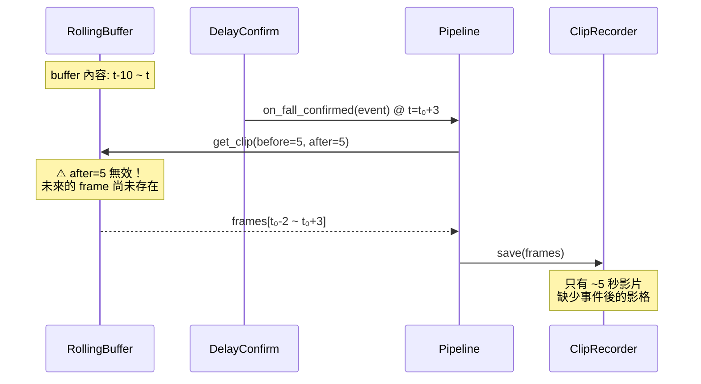
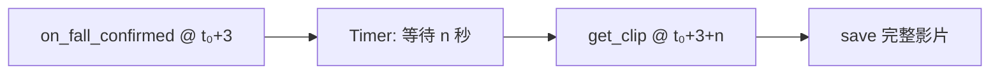
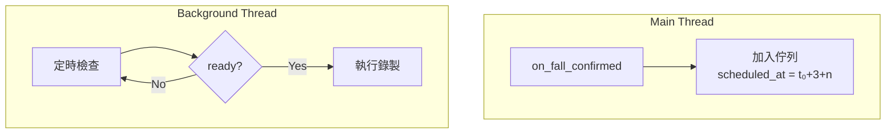
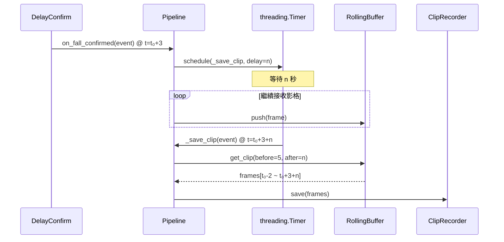

# Event Recorder 功能延伸：Post-Event Recording

> 將 event recorder 從 **t-n ~ t+3** 延伸至 **t-n ~ t+3+n** (包含事件之後 n 秒影片)

**Goal:** 修改 Event Recorder 架構，使其能在事件確認後繼續錄製 n 秒的影片，完整記錄事件前後的上下文。

**Tech Stack:** Python 3.12+, threading, pytest

---

## Current State Analysis

**已實作：**

- [rolling_buffer.py](file:///home/aipe-tester/Projects/FDS/src/capture/rolling_buffer.py) — 儲存最近 10 秒的影格緩衝區
- [clip_recorder.py](file:///home/aipe-tester/Projects/FDS/src/events/clip_recorder.py) — MP4 影片儲存
- [delay_confirm.py](file:///home/aipe-tester/Projects/FDS/src/analysis/delay_confirm.py) — 3 秒延遲確認狀態機
- [pipeline.py](file:///home/aipe-tester/Projects/FDS/src/core/pipeline.py) — 主流程協調器

**The Gap：**

- `on_fall_confirmed()` 在事件確認時**立即執行**錄製
- `rolling_buffer.get_clip(after_sec=5)` **無法取得未來影格**
- 缺乏延遲錄製或串流式錄製機制

---

## Problem Illustration



---

## Proposed Solutions

### Solution A: Delayed Recording (推薦 — 快速實現)

**概念：** 使用 `threading.Timer` 延遲 n 秒後執行錄製



**優點：** 改動最小、向後相容
**缺點：** 程式關閉時影片可能遺失

---

### Solution B: Event Queue Pattern (推薦 — 生產環境)

**概念：** 將錄製任務放入佇列，由背景執行緒定時執行



**優點：** 可靠性高、可持久化、易擴展
**缺點：** 需新增模組、執行緒管理

---

### Solution C: Streaming Recording

**概念：** 事件確認時開始即時寫入，n 秒後停止

**優點：** 記憶體最優
**缺點：** 架構改動大、I/O 阻塞風險

---

## Solution Comparison

| 方案                     | 改動範圍 | 複雜度     | 記憶體需求 | 可靠性 |
| ------------------------ | -------- | ---------- | ---------- | ------ |
| **A: Delayed Recording** | 小       | ⭐         | 高         | 中     |
| **B: Event Queue**       | 中       | ⭐⭐⭐     | 高         | 高     |
| **C: Streaming**         | 大       | ⭐⭐⭐⭐⭐ | 低         | 高     |

---

## Task 1: Implement Delayed Recording (Solution A)

**Files:**

- Modify: `src/core/pipeline.py`
- Modify: `config/settings.yaml`
- Test: `tests/test_delayed_recording.py`

### Step 1: Write the failing test

Create `tests/test_delayed_recording.py`:

```python
"""Tests for delayed clip recording."""

import pytest
import time
from unittest.mock import Mock, patch, MagicMock
import numpy as np
import threading

from src.core.pipeline import Pipeline
from src.core.config import (
    Config, CameraConfig, DetectionConfig, AnalysisConfig,
    RecordingConfig, NotificationConfig, LifecycleConfig,
)
from src.events.observer import FallEvent
from src.capture.rolling_buffer import FrameData


@pytest.fixture
def config_with_delayed_recording():
    """Config with clip_after_sec = 5."""
    return Config(
        camera=CameraConfig(source=0, fps=15, resolution=[640, 480]),
        detection=DetectionConfig(model="yolo11n.pt", confidence=0.5, classes=[0]),
        analysis=AnalysisConfig(
            fall_threshold=1.3, delay_sec=3.0,
            same_event_window=60.0, re_notify_interval=120.0,
        ),
        recording=RecordingConfig(
            buffer_seconds=15,  # 增加 buffer 以容納延遲錄製
            clip_before_sec=5,
            clip_after_sec=5,
        ),
        notification=NotificationConfig(
            line_channel_access_token="", line_user_id="", enabled=False,
        ),
        lifecycle=LifecycleConfig(clip_retention_days=7),
    )


class TestDelayedRecording:
    """Tests for delayed clip recording after fall confirmed."""

    @patch("src.core.pipeline.Camera")
    @patch("src.core.pipeline.Detector")
    @patch("src.core.pipeline.EventLogger")
    @patch("src.core.pipeline.ClipRecorder")
    def test_recording_is_delayed_by_clip_after_sec(
        self, mock_recorder, mock_logger, mock_detector, mock_camera,
        config_with_delayed_recording, tmp_path
    ):
        """Recording should happen after clip_after_sec delay."""
        db_path = str(tmp_path / "test.db")
        pipeline = Pipeline(config_with_delayed_recording, db_path=db_path)

        event = FallEvent(
            event_id="test_evt",
            confirmed_at=100.0,
            last_notified_at=100.0,
            notification_count=1,
        )

        # Record start time
        start = time.time()
        pipeline.on_fall_confirmed(event)

        # Recording should NOT happen immediately
        assert not mock_recorder.return_value.save.called

        # Wait for delay + small buffer
        time.sleep(config_with_delayed_recording.recording.clip_after_sec + 0.5)

        # Now recording should have happened
        assert mock_recorder.return_value.save.called
```

### Step 2: Run test to verify it fails

```bash
uv run pytest tests/test_delayed_recording.py -v
```

Expected: FAIL (recording happens immediately)

### Step 3: Update Pipeline.on_fall_confirmed

Edit `src/core/pipeline.py`:

```python
import threading

class Pipeline:
    def __init__(self, config: Config, db_path: str = "data/fds.db"):
        # ... existing init code ...
        self._pending_recordings: list[threading.Timer] = []

    def on_fall_confirmed(self, event: FallEvent) -> None:
        """Schedule clip recording after delay."""
        delay_sec = self.config.recording.clip_after_sec
        timer = threading.Timer(
            delay_sec,
            self._save_clip,
            args=[event]
        )
        timer.daemon = True
        timer.start()
        self._pending_recordings.append(timer)

    def _save_clip(self, event: FallEvent) -> None:
        """Execute the actual clip saving."""
        frames = self.rolling_buffer.get_clip(
            event_time=event.confirmed_at,
            before_sec=self.config.recording.clip_before_sec,
            after_sec=self.config.recording.clip_after_sec,
        )
        if frames:
            clip_path = self.clip_recorder.save(frames, event.event_id)
            if clip_path:
                self.event_logger.update_clip_path(event.event_id, clip_path)
                logger.info(f"Clip saved: {clip_path}")

    def shutdown(self) -> None:
        """Cancel pending recordings on shutdown."""
        for timer in self._pending_recordings:
            timer.cancel()
        self._pending_recordings.clear()
```

### Step 4: Update RollingBuffer with thread safety

Edit `src/capture/rolling_buffer.py`:

```python
import threading
from collections import deque
from dataclasses import dataclass

import numpy as np


@dataclass
class FrameData:
    timestamp: float
    frame: np.ndarray
    bbox: tuple[int, int, int, int] | None


class RollingBuffer:
    def __init__(self, buffer_seconds: float = 10.0, fps: float = 15.0):
        self.max_frames = int(buffer_seconds * fps)
        self.buffer: deque[FrameData] = deque(maxlen=self.max_frames)
        self._lock = threading.Lock()

    def push(self, frame_data: FrameData) -> None:
        with self._lock:
            self.buffer.append(frame_data)

    def get_clip(
        self,
        event_time: float,
        before_sec: float = 5.0,
        after_sec: float = 5.0,
    ) -> list[FrameData]:
        start_time = event_time - before_sec
        end_time = event_time + after_sec
        with self._lock:
            return [f for f in self.buffer if start_time <= f.timestamp <= end_time]

    def clear(self) -> None:
        with self._lock:
            self.buffer.clear()

    def __len__(self) -> int:
        return len(self.buffer)
```

### Step 5: Update settings.yaml

```yaml
recording:
  buffer_seconds: 15 # 增加: delay_sec(3) + clip_before(5) + clip_after(5) + buffer(2)
  clip_before_sec: 5
  clip_after_sec: 5
```

### Step 6: Run tests

```bash
uv run pytest tests/test_delayed_recording.py -v
uv run pytest -v  # 確認無 regression
```

### Step 7: Commit

```bash
git add src/core/pipeline.py src/capture/rolling_buffer.py config/settings.yaml tests/test_delayed_recording.py
git commit -m "feat(recording): implement delayed clip recording for post-event capture"
```

---

## Task 2: Add Graceful Shutdown

**Files:**

- Modify: `src/core/pipeline.py`
- Test: `tests/test_pipeline_shutdown.py`

### Step 1: Write the failing test

```python
"""Tests for Pipeline graceful shutdown."""

import pytest
import threading
from unittest.mock import patch, MagicMock

from src.core.pipeline import Pipeline
from src.events.observer import FallEvent


class TestPipelineShutdown:
    """Test graceful shutdown of pending recordings."""

    @patch("src.core.pipeline.Camera")
    @patch("src.core.pipeline.Detector")
    @patch("src.core.pipeline.EventLogger")
    def test_shutdown_cancels_pending_timers(
        self, mock_logger, mock_detector, mock_camera, config, tmp_path
    ):
        """shutdown() should cancel all pending recording timers."""
        db_path = str(tmp_path / "test.db")
        pipeline = Pipeline(config, db_path=db_path)

        # Schedule a recording
        event = FallEvent(
            event_id="test", confirmed_at=0, last_notified_at=0, notification_count=1
        )
        pipeline.on_fall_confirmed(event)

        # Should have pending timer
        assert len(pipeline._pending_recordings) == 1

        # Shutdown
        pipeline.shutdown()

        # Timer should be cancelled
        assert len(pipeline._pending_recordings) == 0
```

### Step 2: Update Pipeline.run

```python
def run(self) -> None:
    logger.info("Starting fall detection pipeline...")
    try:
        while True:
            frame = self.camera.read()
            if frame is None:
                continue

            current_time = time.time()
            state = self.process_frame(frame, current_time)

            if state == FallState.CONFIRMED:
                logger.warning("Fall confirmed!")

    except KeyboardInterrupt:
        logger.info("Stopping pipeline...")
    finally:
        self.shutdown()  # 新增
        self.camera.release()
        self.event_logger.close()
```

### Step 3: Commit

```bash
git add src/core/pipeline.py tests/test_pipeline_shutdown.py
git commit -m "feat(pipeline): add graceful shutdown for pending recordings"
```

---

## Task 3: Documentation Update

**Files:**

- Modify: `docs/ARCHITECTURE.md`
- Modify: `README.md`

### Update ARCHITECTURE.md

Add to Sequence Diagram section:

````markdown
### Post-Event Recording Flow


````

````

### Step: Commit

```bash
git add docs/ARCHITECTURE.md README.md
git commit -m "docs: add post-event recording architecture documentation"
````

---

## Potential Issues & Mitigations

| 問題               | 說明                                 | 解法                                |
| ------------------ | ------------------------------------ | ----------------------------------- |
| **記憶體壓力**     | 增大 buffer_seconds 會增加記憶體使用 | 降低 resolution 或 fps              |
| **Race Condition** | 程式關閉時影片遺失                   | `shutdown()` 時強制寫入當前 buffer  |
| **Thread Safety**  | 並發存取 RollingBuffer               | 已在 Task 1 加入 `threading.Lock`   |
| **多事件堆積**     | 連續事件導致 Timer 堆積              | 限制 `_pending_recordings` 最大數量 |

---

## Memory Calculation

```
記憶體 = buffer_seconds × fps × frame_size
       = 15 秒 × 15 fps × (640 × 480 × 3 bytes)
       ≈ 207 MB
```

> [!NOTE]
> 若使用更高解析度 (1280×720)，記憶體需求將增至 ~622 MB

---

## Summary

| Task | Description                 | Files                                               |
| ---- | --------------------------- | --------------------------------------------------- |
| 1    | Implement delayed recording | `pipeline.py`, `rolling_buffer.py`, `settings.yaml` |
| 2    | Add graceful shutdown       | `pipeline.py`                                       |
| 3    | Update documentation        | `ARCHITECTURE.md`, `README.md`                      |

**Estimated commits:** 3
**Estimated effort:** 2-3 hours

---

## Future Enhancements (Solution B)

若需更高可靠性，可在後續迭代中實作 Event Queue Pattern：

1. 建立 `src/events/recording_scheduler.py`
2. 使用 SQLite 持久化排程任務
3. 實作重試機制

---

_建立日期：2026-01-05_
