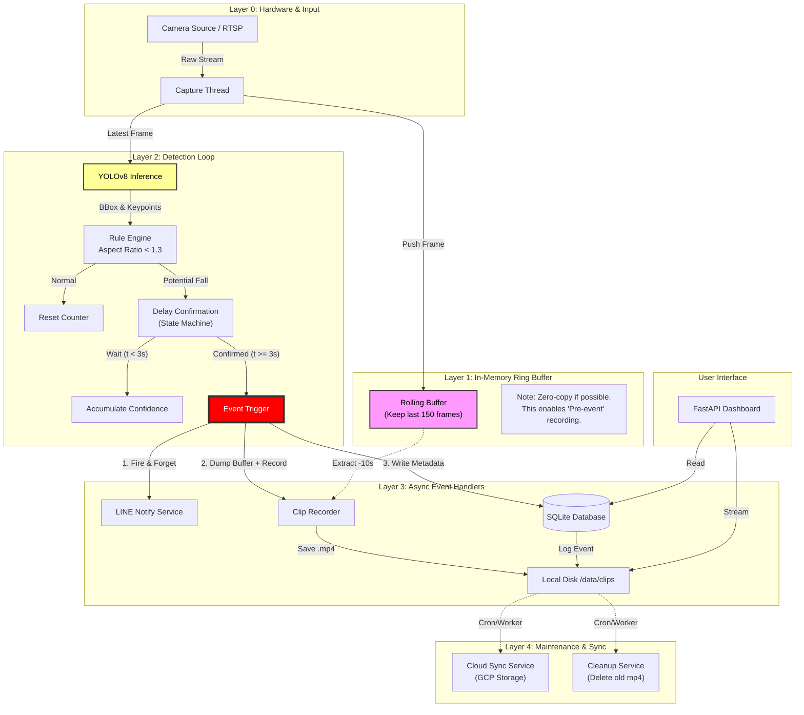
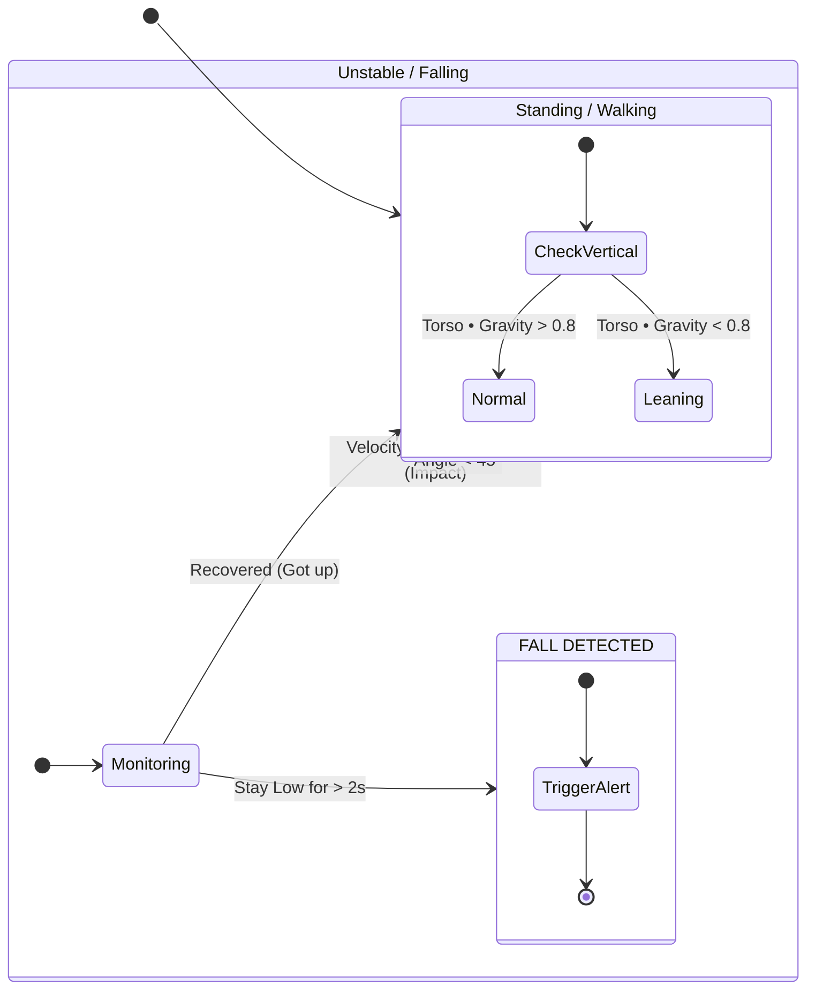
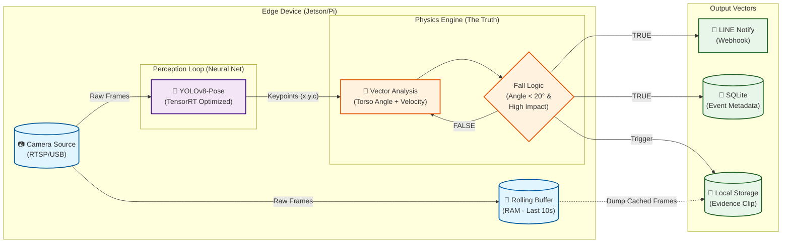

# 可能的方向

## 1



## 1.5



## 2



## 2.5

### Phase 1: Context & Reality Check

如果你真的在用 **LLM (Large Language Model)** 來判斷一個人是否跌倒，這完全是資源誤用。

- **跌倒是一個物理事件（Physics Event）**：是重力（Gravity），是 $F=ma$，是幾何變化。
- **不需要 LLM**：你不需要一個幾十億參數的模型來告訴你「垂直的矩形變成了水平的」。
- **結論**：這是對算力資源的犯罪。如果是為了工程落地，**Delete it immediately**.

### Phase 2: Delete (刪除部分)

最好的部分就是沒有部分（The best part is no part）。

1. **Delete LLM Module**

   - 用簡單的**幾何數學（Geometry Math）**代替。
   - 計算 Bounding Box 的 Aspect Ratio 或者 Keypoints 的角度向量。
   - 延遲（Latency）從幾百毫秒降到微秒級（Microseconds）。

2. **Refactor OpenCV**

   - 這是工具庫，不是架構模組。把它整合進 Detection Loop。不要讓它成為一個單獨的「步驟」。

3. **Consolidate Storage**
   - **Current State**: Local 影像緩存區 & 雲端骨架儲存區 & 事件原始影像儲存 (三個儲存桶？這是數據碎片化)。
   - **Fix**: 如果你有 Docker Volume，你只需要一個統一的 Event Log。
   - **GCP Strategy**: 為什麼要把「骨架 JSON」傳到 GCP？除非要做大規模訓練，否則這是浪費頻寬。建議打包成一個事件檔（Video + Metadata）一次上傳。

### Phase 3: Simplify (簡化流程)

目前的流程太長了：
`Camera` $\rightarrow$ `Array` $\rightarrow$ `Detection` $\rightarrow$ `Judge (LLM??)` $\rightarrow$ `Delay` $\rightarrow$ `Notify`

**優化後的物理路徑**：
`Sensor (Photon)` $\rightarrow$ `Compute (Tensor)` $\rightarrow$ `Action (Signal)`

**重新設計邏輯**：

1. **Detection (YOLOv8)**: 直接輸出 Keypoints。
2. **Logic**: 不要只看長寬比（Aspect Ratio）。長寬比是弱指標（Weak Signal）。一個人彎腰綁鞋帶，長寬比也會變。
3. **First Principles Fix**: 測量 **速度（Velocity）** 和 **姿態變換率（Rate of Change）**。
   - 跌倒 = $\frac{d(Head\_Position)}{dt}$ 突然變大 + $Angle_{torso}$ 變為 0。
   - 如果是快速的姿態變化，你不需要等待 3 秒來確認，可以直接觸發。

### Phase 4: Accelerate (加速)

1. **Python Version**: README 寫 Python 3.12。對於原型（Prototype）可以。但若部署到 Edge (Raspberry Pi/Jetson)，此架構依然適用，但需注意優化。
2. **Docker**: 很好，保持這個。這是唯一能讓部署標準化的東西。
3. **Delay Confirm (3s)**:
   - 在急救場景中，3 秒是永恆。
   - 如果模型準確率夠高（使用骨架角度），可縮短至 0.5 秒或 0。
   - **正確邏輯**: "偵測到高衝擊力動作" $\rightarrow$ "發出警報"。
   - **原則**: 在安全領域，False Positive (誤報) 優於 False Negative (漏報)。

### Phase 5: Final Architecture (最終架構)

這是我會構建的版本。簡單，快速，沒有廢話。

1. **輸入 (Input)**: RTSP Stream / USB Cam
2. **計算核心 (Core Loop)**:
   - **Frame In**: 取得影像。
   - **Inference (TensorRT)**: 運行 YOLOv8-Pose (轉為 TensorRT 格式加速 5-10 倍)。
   - **Vector Analysis**: 計算軀幹向量 $V_{torso}$ 與地面的夾角 $\theta$。
   - **Trigger**: If $\theta < 20^\circ$ AND $\Delta t_{change} < 500ms$ $\rightarrow$ **FALL DETECTED**.
3. **Action**:
   - 寫入 SQLite (Metadata).
   - 觸發 Webhook (Line Notify).
   - 保存前後 10s 影片 (Rolling Buffer Dump).

**刪除的東西**：

- LLM (Useless).
- 複雜的 "Delay Confirm" 狀態機 (用物理特徵取代人為延遲).
- 分散的儲存邏輯.

### Verdict

目前的系統是典型的「堆疊式開發」（Stack-based development）。能跑，但臃腫。如果你想把它變成產品，**Delete the LLM reference, optimize the physics logic, and ship it.**

## 3

根據你的系統架構，YOLO 已經幫你解決了最難的「感知」問題（給出了 Keypoints），你的「物理引擎」只需要做一件事：**判斷這些點的幾何關係變化是否符合重力加速度導致的失控。**

```python
import numpy as np
from dataclasses import dataclass

@dataclass
class PoseState:
    norm_torso_vector: np.array  # [dx, dy] normalized
    hip_velocity_y: float        # Normalized distance per second
    bbox_aspect_ratio: float     # width / height

class FallDetector:
    def __init__(self, fps=30):
        # Good Taste: Configurable, scale-invariant thresholds
        self.FALL_ASPECT_RATIO = 1.2  # Width > Height means lying down
        self.IMPACT_VELOCITY = 0.05   # 5% of screen height per frame (fast!)
        self.GRAVITY_VECTOR = np.array([0, 1]) # Assuming camera is upright

    def analyze(self, keypoints, history) -> bool:
        """
        Returns True if fall detected.
        Input: keypoints (normalized 0-1), history (previous frames)
        """
        # 1. Simplify Data Structure: Get Torso Vector
        # Index: 5=L_Shoulder, 6=R_Shoulder, 11=L_Hip, 12=R_Hip
        mid_shoulder = (keypoints[5] + keypoints[6]) / 2
        mid_hip = (keypoints[11] + keypoints[12]) / 2

        torso_vector = mid_shoulder - mid_hip

        # 2. The Math (Geometry): Alignment with Gravity
        # Dot product is faster and cleaner than calculating degrees.
        # If torso aligns with gravity, dot product is ~1. If horizontal, ~0.
        vertical_alignment = np.dot(torso_vector, self.GRAVITY_VECTOR)

        # 3. The Physics: Velocity (Kinetic Energy proxy)
        prev_hip = history[-1].mid_hip if history else mid_hip
        velocity_y = (mid_hip[1] - prev_hip[1]) # Positive means going down

        # 4. The Logic: Combine Spatial and Temporal features
        # A fall is: Not Vertical anymore AND (Moved down fast OR Is wide on ground)

        is_horizontal = abs(vertical_alignment) < 0.5 # Less than ~60 degrees projection
        high_impact = velocity_y > self.IMPACT_VELOCITY

        # Heuristic: If you are horizontal and logic suggests you hit the ground hard
        if is_horizontal and high_impact:
             return True

        # Catch the "Slow Fall" (Old people): Horizontal for N frames?
        # That belongs in the State Machine logic, not per-frame physics.

        return False
```
